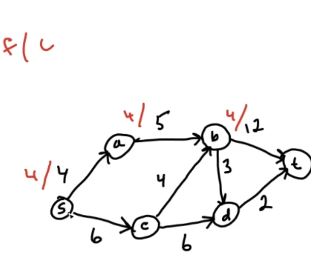
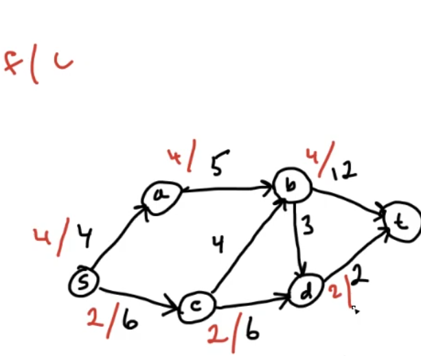
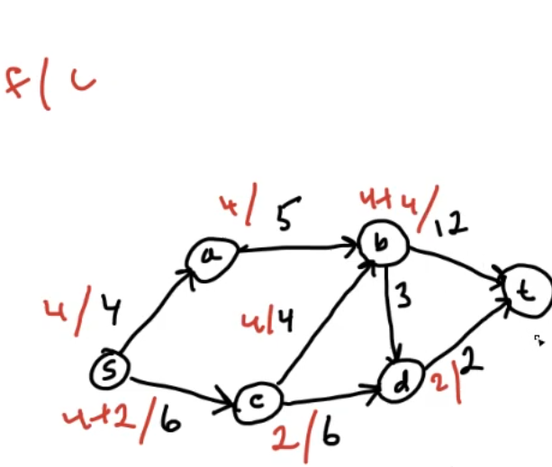
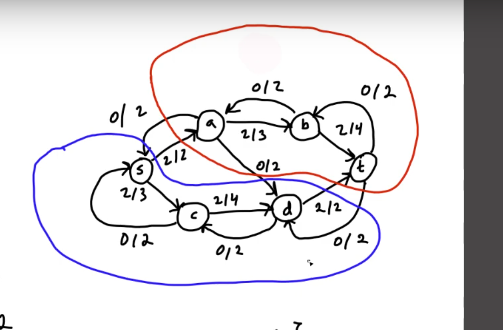
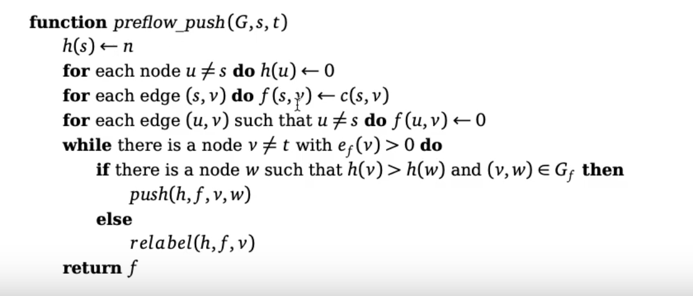
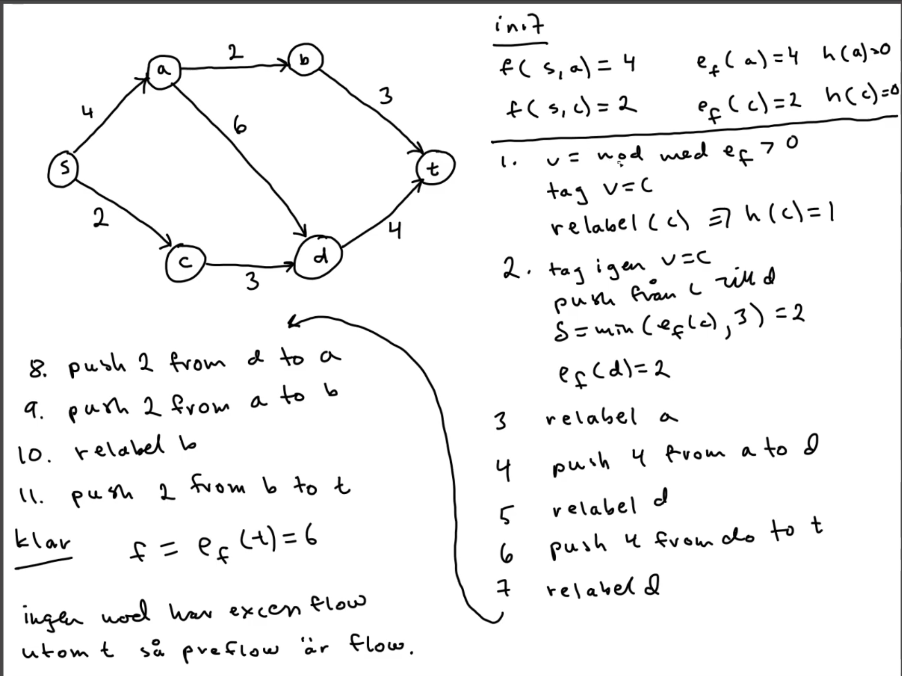
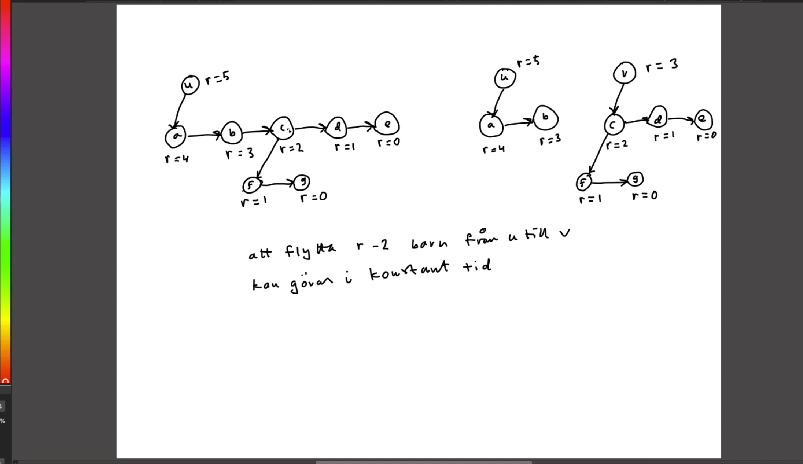

# Info
- **Hur bra ska vi kunna bevisen?**
- **Farligt att jag bara sett på videos?**
  - Fråga på lektionen
  - Fråga även om typ extentor finns
    - Eller tänk ut vad jag vill fråga om tentan
- Kolla hur han töänker när han räknar tidskompelxitet
 - 6 labs  
- jonasskeppstedt.net har videor (notera att har inget om lab 4)  
- calendly.com/forsete
- På tenta så är det inte skriftliga problem
  - Snarare "hur skulle du påbörja denna lösning"
  - Skulle detta kunna gå genom att använda greedy?
  - Förklara för en fyraåring hur man gör en viss sak (något han sa att han ofta frågar)
- I varje video så står det 3, 4, 5.
  - Representerar vilken nivå videon är på

- Måste vi ha koll på bevisen?
  - Oklart
  - Gör dom i efterhand isf?
  - Fråga på lektionen

- Varje video har en relevans titel
  - Ex nivå 3 -> behövs för att få en trea
  - nivå 4 -> behövs för att få en fyra
  - nivå 5 -> behövs för att få en femma
### Todo tidigt i kursen
- Start preparing lab 2
- Download documentation
- Read input format (?)
  
# Föreläsning 1
## Algoritmer
- P: Polynomisk  tid
- NP: Lätt att testa, svårt att lösa
  - Definition: Om någon gissar en lösning så kan man på polynomisk tid verifiera om det är rätt eller fel
- NPC: Svårt

## Big O notation
 - Notera att O(n) ingår i mängden O(n²)  
 - Omega(n): 

- O(n^k) klassas som en effektiv algoritm

## Matchning
A matching M is a set of pairs (x,y) such that and x and y appear in at most one pair
 - Kan exempelvist användas för att hitta en bra matchning mellan jobb och personer

If all pairs are matched: M is a perfect matching
 - All companies have exaclty one job offer
 - Each company and student has an ordered list of preferences
 - If it is the best match so far, the match is added
   - If at a later stage, another student is added, the individual is switched out
   - Unstable matching: if either the student or the company would prefer another match
   - Is carried out by Gale-shapley algorithm
   - 


Algorithm temrination
Lemma: The Gale-Shapley algorithm terminates after at most n² iterations, due to there being at most that many combinayions of students and companies
 - Svårt att dra denna slutsats från koden, men lättare att se det då kombinationer räknas mellan student och företagslistan. 

Hint lab 1:
- The companies should not store students as preference list. Instead of storing 4,2,1,3 store 3,2,4,1. Meaning that student 3 is the first choice, 2 is the second choice, etc. This is referred to as the inverted list.

# Föreläsning 2  
Interval scheduling: 
The need of scheduling the use of a resource

Weighted Interval Scheduling

Solved easiest by dynamic programming

### Bipartite graph mathing
The nodes are partitioned in two sets  
No edges between nodes in the same set  
...tror inte detta var så viktigt i nuläget

## Hash map
Open adressing
- Hashfunktionen ger en index
- Förvarar nyckeln och datan i olika tabeller
  - stores saker i olika listor för att man bara behöver datan, så när datan sedan hämtas, så undeviker man att hämta nyckeln (när datan försöker vara smart - se yttligare förklaring kring detta längre ner)
- Vad lägg koliderad data?

Seperate chaining
- Hashfunktionen ger en index
- Vid kollision så läggs elementet i en länkad lista på den platsen

Load factor:
a = n/m = antal element stored / storlek på tabellen
## Seperate chaining
- Seperate chaining allows higher load factor but is slower to search (speciellt vid hög load factor)
  - Avoidance method: move frequently used elements to the front of the list
  - List tend to be slower because the data is spread out in the ram, meaning that the chance that the data is in the cache is lower  

## Open adressing
- Open adressing allows lower load factor but is faster to search
  - In array, the data is stored in a contigous manner (i en bunt, där varje element ligger efter varandra), meaning that the chance that the data is in the cache is higher
- Load factor has to be as low as possible, and always lower than one

### Linear probing (open adresesing method)
- Linear probing is a method of open adressing
- If a collision occurs, the next free slot is used instead
- Problem: If we delete an element, can we simply replace it with null?
  - no. Better solution is to mark the element as deleted
  - Alternativly move the next element to the deleted element
    - Problem: We also have to make sure to check if the element actually should be moved to the deleted element
      - It should only be moved if the next comming element should of originally been placed at the deleted element

**Clustering**: When a lot of elements are placed in a row, meaning that the next element is placed in the next slot
- Side effect: An increased amount of unsuccessful searches
- Dvs du söker första positionen: Den är upptagen
- Söker nästa position: Den är upptagen
- etc
- Clustering casues a lot of unsuccessful searches
### Quadratic probing (open adresesing method)
- Quadratic probing is a method of open adressing
- Instead of simply adding pos+i (pos+1, pos+2, pos+3, pos+4) we instead add i² (pos+1, pos+4, pos+9, pos+16)
- A maximum of load factor is set
- (Tip: when debugging the hashFunction x -> 0 is good)
- Fattade inte detta helt

### Double hashing (open adresesing method)
- Double hashing is a method of open adressing
- Have two hash functions
- h(k,i) = h1(k) + i*h2(k)
  - where k is the key, i is the number of collisions, and h1 and h2 are the two hash functions
- If clustering occurs, the second hash function will be used to spread the elements out
  - Avoids clustering
- Chosing h2:
  - Let h2 be relativly prime to prime
    - Achived by m = 2^n
    - ...
  
## Graphs
- A graph is a set of nodes and edges
- Can be directed or undirected
  - Dvs om man kan gå i båda riktningarna eller i bara en riktning
- Ofta i kursen: n antalet noder, m antalet kanter

### Graph representation
Two main ways of representing a graph:

### Adjacency matrix
- A matrix where the rows and columns represent the nodes
- If there is an edge between two nodes i and j, the value of (i,j) is 1, otherwise 0
- Fördel: Easy to check if there is an edge between two nodes
- Nackdel: Diffucult to figure out all neighboars of a node
- Optimization: Store only the upper or lower triangle of the matrix  
### Adjacency list
- A list where each node has a list of its neighbors
- Fördel: Easy to figure out all neighboars of a node
- Nackdel: Diffucult to check if there is an edge between two nodes

### Path and connectivity
- A path is a sequence of nodes where each node is connected to the next node
- An undirected graph is connected if there is a path between every pair of nodes

### Trees
- A tree is a connected undirected graph without cycles
- A tree always has n-1 edges
- In a rooted tree, there is a special node called the root

## Grafsökning
### Depth first search (DFS)
- Start at a node and visit all nodes that are reachable from that node
- Numerera noderna med så kallade "djupet först nummer"
- Görs lättast med rekursion 
  - `function DFS = forall(osökta noder): DFS(nästa nod)`

tror att:  
Cycle: Go to a lower index som inte är besökt
Forward: Go to a higher index som inte är besökt
Cross: 

# Föreläsning 3
## Strong connectivity in directed graphs
* Nodes u and v are mutually reacjaböe of tjere os a path from u to v and a path from v to u
* A directed graph is strongly connected if every pair of nodes are mutually reachable

### Lemma
* Let s be any node in a directed graph G. 
  * G is strongly connected <=> every node is reachable from s and s is reachable from every node

### Determening strong connectivity
1. Select any node s tllhör V
2. Use BFS on G from v and check if all of V is reachable
3. Consttruct G^r from G by revering all edges
4. Use BFS from G^r from s and check if all of V is reached
5. if s can reach a node u in G^r, thenu can reach s in G
6. if all of V is reached in both searches, G is strongly connected
  * O(n+m)

### Alternativly: Tarjan's algorithm
```
int dfnum
procedure strong_connect (v)
  dfn (v) ← dfnum
  lowlink (v) ← dfnum
  visited(v) ← true
  push (v)
  dfnum ← dfnum +1

  for each w ∈ succ(v) do
    if (not visited(w)) {
      strong_connect (w)
      lowlink(v) ← min (lowlink (v), lowlink(w))
    } else if (dfn (w) < dfn (v) and w is on stack)
        lowlink(v) ← min (lowlink (v), dfn (w))

  if (lowlink (v) = dfn (v))
    scc ← ∅
    do
      w ← pop ()
      add w to scc
    while (w ̸= v)
    process_scc(scc )
end

```

**The steps:**
* Se slidsen för stegen
* Säkert lättare att bara se en video på det

**Remarks**  
* Consider the edge (v,w)  
* When w is not yet visited, we must visist it by calling strong_connect(w)  
* When w is already visited, we must check if w is on the stack
* If w has been visisted: we have two main cases:  
  1. w is not on the stack, because it has already found its SCC
  2. w is on the stack, baucse it is waiting to be popped from the stack  
     1. If dfn(w) < dfn(v), then v must set its lowlink so it does not think it is its own SCC
     2. If dfn(w) > dfn(v) then no more information for v is availbable. There is another path from v to w due to which they belong to the same SCC

## Greedy algorithms
* It is not trivial to define that makes an algoirithm greedy  
  * The main idea is to se a simple rule to ake decisions (without taking all information into account)
* Proving a greedy algorithm is optimal:
  * Method 1: The greedy algoritm "stays ahead" - by proving it is always at least as good as an optimal solution
  * Exchange argment - transform the output of an optimal algoritm (without changing its quality) to the output of the greedy algoritm

## Interval scheduling
* A set R of requests, ri with a start time s(i)  and a finish time f(i)
* A set of requests is **compatible** if they do not overlap in time
* The **interval scheduling problem** is to find the largest subset S of R that is compatible
* All requests have equal value and it is the size of S we want to maximize
* A compatible set of maximum size is called an **optimal schedule**

### Greedy algorithm for interval scheduling
```
procedure schedule (R)
S ← ∅ /* S is a sequence */
while R ̸= null
  r ← select a request from R
  remove r from R
  add r to the end of S
  remove all request in R which overlap with r
return S

```
**A good select function**
Take the request with the earliest finish time

In psuedocode:
1. Select the request with the earliest finish time
2. remove all requests that overlap with this request
3. repeat until R is empty

**Example of proving that this is optimal**
* Using "our algorithm stays ahead of the optimal solution" method
* That is size(S) >= size(T)
  * Where S is the output of our algorithm and T is the output of the optimal algorithm
  * Meaning that our algorithm is at least as good as the optimal solution
  * Or in this case: They output the samer thing

### Greedy algorithm for interval scheduling while to minimize delays
* Consider now requests with a soft deadline d(r) and a time length t(r)
* It is not a disaster to faila  soft deadline compared to a hard deadline
* s(r) and f(r) are the start and finish times and in this problem they are the output, not the input
* The delay of one request is max(0, f(r) - d(r))
* goal: minimize the total delay of all requests

**How?**
* Select next with earliest deadline
* Schedule requests so that s(ri+1) = f(ri)

**Sidenote: var denna föreläsning klar?**

# Föreläsning 4
## Närmaste vägen för en riktad graf - Dijkstra's algoritm
**Antar att våran graf har godtyckliga positiva vikter**

### Variabler
d(v) = minsta avståndet från start (s) till v (slut)
 - Behöver två mängder
  - S: Sökta noder
  - Q: Noder vi inte känner till

### Algoritmen
* Från start: väljer ut den nod som ligger i Q, som har den kortaste vägen från startnoden. 
  * Hur? Titta på en nod på S.
  * minsta möjliga d(u) + w(u, w), där uϵS, vQ

  **Måste vi ha koll på varför det leder till optimal lösning?**

### Implementering av Dijkstra (pseudocode)

```
Mängder Q och S
S behöver ingen datastruktur
Q använder en prioritetskö
prioritet i Q är d(v)

d(s) = 0
Q = V - {s}
S = {s}

while Q isNotEmpty
u = remove_min(Q)
for each neighbour v of u
  if d(u)+w(u,v) < d(v)
    d(v) = d(u)+w(u,w)
    pred(v)=u

```

### Tidskomplexitet?
m kanter
n noder

log n att sortera prioritetskö
För varje kant, tar vi bort en nod och sorterar:

O(m*log n)

---

## Hitta ett minimalt uppspännande träd (MST)
Vill minimera den totala vikten av alla kanter i trädet

### Alternativ 1: Prims algoritm
* Liknar Dijkstra
* Starta i en godtycklig nod s och lägg till närmaste noden till de vi redan besökt

**Utförande**
Ungefär samma som dijkstra (står i boken)

### Alternativ 2: Kruskal's algoritm
**Pseudokod**

1. Sotera alla kanter
2. Tag billigaste kanten som inte ger en cykel 
* Notera att kanten inte måste vara precis brevid trädet vi redan har
3. Upprepa tills vi har n-1 kanter

**Hur undviker vi att skapa en cykel**
* Då vi väljer en kant, lägg till båda noderna i en mängd
* om man vill lägga till (a,b)
  * givet find(x) ger mängden som x är i:
    * gör find(a) och find(b)
    * om de är samma, så är det en cykel
* Notera att vi skapar nya mängden för disjunkta mängder
* Återkommer till implementeringsdetaljer

### Bevis till de båda
**Safeedges**
1. Låt A vara en delnäng av kanterna i något MST
2. Låt SϵV s.t (S,V-S) är en parition av noderna
3. Kanten e = (u,v), eϵE, där uϵS och vϵV-S korsar paritionen
4. En kant är safe om A∪{(u,v)} är en delmängd av kanterna i något MST
5. Lemma om A och S är som ovan och ignen kant i A redan korsar (S,V-S) så är vajre kant med minsta vikt safe

**Själva beviset - Se video**

### Länk till 5 min video om pseudokod för algoritmerna


# Föreläsning 5

### Söndra och härska, devide and conquer
Delar upp problemet i halvor och löser dem rekursivt
* Kombinerar sedan lösningarna till en lösning på hela problemet

* Ex merge sort:
  * Dela upp konstant tid
  * Sorterahalvorna
  * Kombinera på linjär tid
* Antalet jäförelser T(n) = 2T(n/2) + n (n är antalet element); n > 1
* Sedan kollade han på källkoden:

* Uppskatta tiden med antalet jämförelser
* T(n) = 2T(n/2) + n
  * Tillräckligt bra att anta n=2^k
**Bevis genom expandera:**
    * T(n) = 2T(n/2) + n
      * 2^k + 2*2^(k-1) + 4*2^(k-2) + ... + n*2^0
      * Leder till O(n*log2 n) 
**Lemma 2.6**
T(n) = n*log2 n om n = 2^k
Bevis bättre genom induktion
T(1) = 0 sant typ log 1 = 0
Antag att T(n) = n*log2 n
Visa att T(2n) = 2n*log2 2n
T(2n) = 2T(n) + 2n
      = 2(n*log2 n) + 2n
      = 2n*log2 2n

**Lemma 2.7**
T(n) = n*log2 n
(Jobbigare att bevisa om n!=2^k)
men görs genom T(n) = T(tak(n/2))0 + T(golv(n/2)) + n

**Alternativ bevis**
Få ié från små tal
- T(n)/n = 0, 1, 2, 3 -> anta att = log2 n

Nu kan vi anta T(n) = n*log2 n
* Bevisa antagandet

### Master theorem - huvudsatsen
(Även ett alternativt bevis)
T(n) = aT(n/b) + n^s
* Antag att n=b^k
* Kommer få visa fall:

**a < b^s -> T(n) = O(n^s)**
**a = b^s -> T(n) = O(n*log n)**
**a > b^s -> T(n) = O(n^log_b a)**

**Exempel T(n)=2T(n/2)+n**
* a = 2, b = 2, s = 1
  * Från master theorem definitionen

Har alltså a = b^s
- DVS T(n) = O(n*log n)

**Note: Glöm ej förenkla log_b a om möjligt**

### Logaritmer repition
Def: x^a = z -> logx z = a

**Kolla upp log regler**

Samt
log_x z = log_y z * log_x y

Ger:

**a^log_b n = n^(log_b a)**

### Kostnad för löv
Antag n=b^k, T(n) = aT(n/b) + n^s

nivå 0: T(n), 1 nod
nivå 1: T(n/b), a noder
...
nivå k: a^k*T(n/b^k), a^k noder

a^k löv med konstnad O(1)
n =b^k, k = log_b n, dvs a^k = a^log_b n = n^(log_b a)

### Kostnad för interna noderna:
på nivå finns a^i interna noder med (n/b^i)^s
* Totala kostnad: arbetet av alla interna noder
* i=0,1,2,...,log_b n-1 av a^i*(n/b^i)^s=n^s*summa (a/b^s)^i

### Kostnad för löv och interna noder
T(n) = n^log_b a + n^s*summa (a/b^s)^i från 0 till log_b n-1

**Tre fall:**
a/b^s < 1 -> T(n) = O(n^s)
* Vet a < b^s -> så n^s är större än n^log_b a=n^s
* Dominerande term O(n^s)
a/b^s = 1 -> T(n) = O(n^s*log n)
* summan blir då lob_b n
* Term nummer två dominerar
* Få O(n^s*log n)
a/b^s > 1 -> T(n) = O(n^log_b a)
* Samma som förssta men n^lob_b a är större än n^s
  * Summan är växande. Kollar på sista termen och sämför med n^log_b a
* DVS får O(n^log_b a)

### Exempel med hur man ser hur lika åsikter ryska statchefer har
I video 5 på föreläsning 5

### Pseudokod för söndra härska
(han vill invertera en lista)
- Det är det som kostar då han pratar om kostnad där uppe tror jag
1. Dela upp i två halvor
2. Räkna invertieringar i vänster halva
3. Gör för höger halva
4. Kombinera på linjär tid
* Gör genom att plocka "rätt" element från vänster och höger halva
* DVS om man inverterar, plocka det element som är minst (längst till vänster)
  * Lägg till den i den kombinerade listan

### LAB VIDEOS (KKolla slidsen. Fattar bättre genom att labba)
* https://youtu.be/nn9qqVKetDM

* https://youtu.be/E3eMtzHojqs 

* https://youtu.be/tSVYU0H8Wxo

# Föreläsning 7
## Nätverksflöde
* har riktad graf G=(V,E) medm speciella noder s och t
* Kanter har kapacitet c(e) >= 0
* Kanter har flöde f(e) >= 0
* Tänk på att flöde som vatten
  
Vatnnet ska rinna över kantera
* Flödet får inte överstiga kapaciteten
  * 0 <= f(e) <= c(e)

* s är källa (källa)
* t är sänka (mål)

Mål: Hitta maximalt flöde från s till t
- DVS hur mycket flöde går ut från s

### s, t snitt
- Flödet kan aldrig bli mer än s-t snitt har för capacitet
- - V = A U B, A snitt B = {}
- s tillhöer A, t tillhör B
  - cap(A,B) = SUM(c(e)) för alla kanter e som går från A till B, där
  - A är s
  - B är alla noder förutom S

### Flödeskoncerveringsregelen (/kravet)
* För att det ska kallas flöde måste flödet in i en nod v tillhör V - {s,t} vara densamma som flödet ut ur noden
* Så detta gäller alltid för flöden och man kan anta det
  
## Ford-Fulkerson
### Pseudokod (NÄSTAN)
1. f(e) = 0 för alla kanter e
2. hitta en väg p från s till t med F(e) < c(e) för alla kanter e på vägen
   1. Exempelvist med BFS
3. om ingen p finns så är vi klara
   1. Vi har hittat maximalt flöde
4. delta(e)=c(e)-f(e)
5. DELTA = min delta(e) för alla kanter e på vägen p
6. öka f(e) längst p med DELTA
7. goto 2


- Fyra är lägst, tar den på övre routen


- tar undre routen. två är lägst
  

- Cross över vägen så är 4 lägst (mellanskillnaden mellan 6 och 2) alt. 4

- BFS är klar för att alla kanter ut från s är fulla.
  - Kommer ej s till t, med kravet så vi är nöjda


### Varför fungerar det inte alltid?
- Hittar inte alltid maximala flödet för in i en nod, om kapaciteten är mer in eller ut så kan vi blockera en rätt väg om vi råkar välja fel
  - Vill kunna dirigera om felaktigt vald väg

Lösning:
- istället jobba med residualgrafen G_f:
- Alla kanter som fanns förut kallas för framåtkanter
- alla kanter som inte finns förut kallas för bakåtkanter (alla nya)
- När vi vill dirigera om flöde så lägger vi till en bakåtkant åt andra håller (istället för att behöva minska flödet)

**Mer praktiskt hur det fungearar**
Om vi ökar flödet i en riktning så skapar vi en bakåtkant med den kapciteeten som vi ökade med. DVS: om vi på en framåtkant gör 0/4 till 4/4 så gör vi en bakåtkan med 0/4

C_f(u,v) =
* c(u,v) - f(u,v) om (u,v) är en framåtkant
  * Så mycket vi kan öka flödet längst den kanten
* f(v,u) om (u,v) är en bakåtkant
* 0 annars

**Notera om vi ändrar flödet på en framåtkant och det redan finns en bakåt kant, så ta bort den bakåtkanten och sätt din nya bakåtkant**

**Notera:**
För att göra ett unit test om du gjorde rätt eller ej: koplla om flödet in i t är detsamma så flödet ut från s
**Notera**:
- "Finns abra en kant i residualgrafen o man kan öka flödet längst den kanten: om vi skickar ett flöde där f(e) = c(e) så kommer den kanten att försvinna"

### Olika fall
* för framåtkanter:
  * a = c(u,v)
  * b = f(u,v)

a > b: 
* c_f(u,v) = a - b
* cf(v,u) = b

a = b
* c_f(u,v) = c_f(v,u) => bara lägga till en bakåtkant

a < b_
* Omöjligt

**Note** Edmonds-Karp algoritmen är en variant av Ford-Fulkerson algoritmen där specifikt en BFS används för att hitta vägar

### Time complexity
Note C = SUM(c(e)) for all edges e going out from S

* Flow is max C
* Assume heltalskapaciteter
  * Alternativt kalla om det är rationellt
* iF all DELTA = then maximum of C BFS searches
* BFS har time complexity O(V+E)
*  (since E > V) we say O(E)
* => **Timecomplecity** P(C*E)
  * The constant is keept because its still very relevant for big grafs

**What do we do if C is huge**
* Want to avoid small DELTA

* Assume x = 2^k >= C; for minimum k

1. Only consider c_f(e) >= x for the BFS
2. If no new s-t path is found:
   1. halvera x och börja om (goto 1)

### Ett bevis för att Ford-Fulkerson algoritmen finds the maximum flow
* Note level 3
* Check F07, video 5

* Skippade även video 6

### Lemma 4.8
Omdet finns ett flöde i G så att det inte finns någon s-t väg i G_f är flödet maximalt

### Sats 4.2
max flow = min cut
dvs 
maximala flödet = kapaciteten över minsta snittet
* Där snitten är alla s-t snitt som partionerar V

"om vi använder ett snitt som vi upptäcker när det inte lägre finns en s-t väg så ahr vi hittat det maximala flödet" 


+ ett bevis i video 7


**Exempel**
* Gör algirtimen på g_f tills vi får p = nej
  *  Om vi kommer till ett läge där vi inte kan nå t så har vi hittat ett snitt, där vi inte kan gå från A till B. 
* Väljer A och B så att A innehåller s och B innehåller t
  * Samt max kapacitet på alla kanter som går från A till B
  * samt alla kanter som går från B till A har f(e) = 0

* Om man kollar på bilden tror jag man kan dra slutsatsen att maxflödet är 2+2? (dvs 4)


  


(bevis, video 7)

## Goldberg-Tarjan (pre flow push)
* Använder också residualgrafen
* Men ryter mot att i en nod (som icke är s och t) så ska inflödet vara större än utflödet
  * Dvs inflödet - utflödet >= 0
  * Goldber-Tarjan algoritmen tillåter detta
  * Kallas då ett förflöde (excess flow) och inte ett flöde för att det bryter mot regeln för flöde

## intuition
* I ford-fulkersson har vi vattenkanaler och ökar lite utan att det läcker
* I Goldberg-tarjar häller vi en hink vatten från s frpn början och ser vad som händer (tillåt pga excess flow)
  * Men vissa kommer puttta tillbaka vatten

## Höjder h(u)
* varje nod har en höjd h(u)
  * h(s) = n
  * h(t) = 0
  * h(u) startar på 0 och kan enbart öka (inte minska)
    * Kan dock enbart öka med ett

* Preflow = förflöde kan öka längst e = (u,v om h(u) = h(v) + 1)
  * Dvs om vi har en kant som går från en nod med höjd 1 mer än den andra noden så kan vi öka flödet längst den kanten
* h och f avser alla höjder h(u) och preflow f(e)
* De är kompatibla om varje kant e = (u,v) i E_f:
  * h(s) = n, h(t) = 0
  * h(u) <= h(v) + 1
* Algoritmen kommer se till att h och f alltid är kompatibla

### Lemma 4.9
Om f och h är komatibla finns ingen s-t väg i G_f

bevis (video 10)

### Lemma 4.10
Om f är kompatibel med h och förflödet är destum är ett flöde (dvs inte excess flow så är det ett maximalt flöde)

Bevis i video 11

### Stategi
Om vi startar med komatibla h och f där 
* h = höjderna för alla u
* f = förflöden för alla e tillhör E_f

och göra om f till att vli ett flöde och f och h fortfarrande är kompatibla så har vi hitta ett maximalt flöde

### Hur görs strategi?

- Video 11 om jag inte förstår

### Exempel

* Notes:
  * Börjar med excess preflow (hur mycket in i a)
    * 4 för a
    * 2 för c
  * Ta något med excess preflow, exempelvist c
    * Kolla om den har högre höjd än en granne.
      * Ja d
    * Det har den inte. Så höjer upp den till ett högre
  * Ta c igen. Nu tillåtet att push från c till d
    * Push min(excess preflow, 3) = 2
    * e_f(d) = excess preflow = 2
  * gör samma för a
    * Pushar 4 till d för a har 4 i excess preflow från början
    * Så d får då 2+4 i excess preflow
* Kollar då å d
  * Den kan push till t. Så den pushar 4. Men har då 2 kvar
* d är den ändra med för mycket preflow
  * d vill pusha till a men får ej för att de har samma höjd
    * Relabel d,dvs ändrar dess höjd
* Kan sedan pusha 2 tillbaka till a
* a har då 2 i excess preflow
* a är den ända med excess, så kollar på den
* a har högre höjd än b, då pushar 2 till b
* b pushar 2 till t

* t är den ända med excess preflow. Den har excess preflow med 2 + 4
  * vårt preflow är nu ett flöde för det inte finns en väg till s till t (ses om man ritar residualgrafen)
  * Det är då vårt maximalflöde = 6

### Lemma 4.11
En nod v med f_(v) > 9 har en väg till s i G_f

Bevis i video 13

### Lemma 4.12
En nod kan bli max 2n-1 hög (utan att bilda en cykel)

* Se bevis i video 13

### Två typer av push 
- Finns två typer av push från v till w längst (v,w)

De två typerna:
1. Om excess preflow begränsar: omättad push
2. Om den kvarvarande kapaciteten begränsar: mättad push

### lemma 4.13
Färre än 2mn saturing push

(bevis i video 14)

### Lemma 4.14
Max 4mn^2 unsaturation push

(bevis i video 15 med potentialmetoden)

### Tidkomplexitet
* PÅbyggnad av beviset i lemma 4.14
  * alla operationer tar O(1) tid
  * preflow-push har alltså tidskompexiteten O(4mn^2)

### Exempel
* Företag har m ansätllda och n arbetsuppgifter
* Alla anställda kan inte utföra alla arbetsuppgifter
* Mex en uppgift per anställ
* Varje uppgift behöver en anställd
* Vi vill få så många uppgifter som möjligt utförs
* Anställda u_i tillhör u och kan utföra arbetsuppgifter v_j
* Kant (u_i, v_j) om u_i kan utföra v_j
  * Hitta en så stor matching som möjligt

- Löses enkelt med flöde:
  - Hitta det maximala flödet
  - Ger även tilldelningen av arbetsuppgifter

# Föreläsning 8

## Hollow heap

### Tidskomplexiteter:
Konstant tid:
- Insert
- Decrease key

Logaritmisk tid O(log n):
- Find min (delete min)
- Delete 
  
### Vad är det?
* En heap är en mängd av träd

* Varje träd har en heap egenskap
  * Om v är föräldrar till w så key(v) <= key(w)

* On nod har en lista med barn
  * Barn är alla noder som den kan nå med en kant
  * Nod har pekare på första barn, skykon och förälder
    * Syskon är noder med samma förälder
  
* Nytt i jämför en hollowheap jämför tmed en fibonaccihheap
  * En nod och dess värde är inte samma sak
  * Vi lagrar key/value pairs och vi kallar value för en item

* En nod har en pekare på en item
  * En item har en pekare på en nod
    * Både item och node har samma key
    * DVS om en nod hvir av med sin item så
      * Kommer den ändå vara kvar på samma plats
      * Eftersom den behåller sin key

### Varför heter det hollow node
* En nod är antingen full eller tom
  * Om den är tom så är den hollow
  * Om vi gör decrease key så ändras nyckeln på item
    * Men noden behåller sin key
    * Noden blir tom
      * DVS null som value
      * Istället skapar vi en ny nod för item

  * Specialfall. Om den var den minsta och vi gör decrease key
    * Så behöver vi bara minska nyckeln

* Om det intevar den minsta noden, men en annan rotnod  
  * Då jan vi också minska den
  * Måste då också kolla om nya nyckeln blev den nya minsta noden

### Link
* Ex då vi lägger till en nya item eller tar vobt den minsta
* V och w är två fullla rotnoder
  * Länkar ihop dem så att en blir föäldrar till den andra
  * Gör detta genom att kolla om key(v) <= key(w)
    * Om det är så så blir w barn till v
    * Annars blir v barn till w
    * Vid link minskar vi antalet rotnoder med 1
      * Dvs vi har en mindre rotnod

## Hollow heap algoritmer
### algoritmen & insert
Kolla upp dom i boken
- Han sa inget notable i videon

### Delete
- Ta bort alla tomma rotnoder och gör då deras barn tll nya rotnoder
- minska antalet rotnoder till 1 genom links
  - Varje nood har en rank som ökar med ett när den blir föräldrar i en link
    - - Rank anger alltså antalet barn (dvs antalet barn i listan av barn - noden själv ingår givetvist inte i antalet barn)
  - Denna version gör link mellan alla rotnoder mellan 0 och nextrank
    - vill göra link mellan rotnoder med samma rank
      - Villa alltså hitta de med samma rank
      - dåligt att gå igenom hela listan för att söka efter detta krav
        - Bättre att göra en array där position i innehåller en rotnod med rank i (i barn)
        - Mer konkret:
          - Behåll array från förra delete (allokera lite större)
          - Skapar en ny genom att gå igenom alla rotnoder och lägga in dem i arrayen
          - om två har samma rank så gör vi link(a,b) där a och b har samma rank
            - Båda deras rank ändras då, så gör den platsen till null
            - (sedan pseudokoden)

### Rank
- För en nod u med rank r gäller
  - Angtingen_
    1. u har r barn med ranar 0,1,2,...,r-1
    2. r > 2 och  blev tom vid en decrease key då har u två barn med ranker r-1 och r-2

- Vid decrease key:
  - En item fluttar från u till ny nod v
  - rank(v) = max(rank(u)-2, 0)
  - Flytta alla barn w från u med rank(w) <= rank(u)
    - Om rank(u) >= 2 behåller u sina barn med r-1 och r-2s
**Ex:**




### Lemma 3.4
En nod med rank r har min F_r+3-1 ättlingar = decendents
- Notera att noden själv räknas som sin egna ättling

F_i är i:te fibonacci talet

(bevis)

### Delete-min time complexity
* H hollow rotnoder försötrs (konstant)
* T rotnoder kvar före links
 * Efter links finns max en rotnod kvar per rank, dvs max log_φ(n) rotnoder kvar

* med link mellan noder med samma rank blir det minst T-log_φ(n) link operatorioner
* Till sist slås denna max log_φ(n) ihop till en rotnod

* Hur många links görs?
  * "då ska vi inte räkna i värsta fall, utan ammorterad tid"
    * Använder potentialmetoder
      * **LÄR DIG POTENTIALMOETODEN**
      * F08, video 7 finns ett exempel på potentialmetoden

  * Slutsats med maximala antalet links
    * Han sa inte hur många links som görs

# Föreläsning 9

**Fortsättning, föreläsning 9**

## Proving NP-completness
* Consider a new problem Y such that:
  * We cannot come up with an efficient algorithm for Y
  * We suspect it is NP-complete

How can we prove it is?
* Firstly, does it have a polynomial time verifier so Y ∈ NP?
* Can we make a reduction from a problem X which is known to be NP-complete?

That is: can we solve X using a reduction to Y ? X ≤P Y
* If that is the case, we have proved Y is NP-complete

Given a circuit composed of logical gates (such as AND, OR, and NOT gates) that operates on binary inputs and produces a binary output, the problem of circuit satisfiability asks whether there is an input combination that produces a true output.

## Circuit satisfiability (Boolean satisfiability) (SAT)
First problem to be concluded as NP-complete
- The cook theorem: The Circuot satisfiability problem is NP-complete (han har ett bevis också)
Given a circuit composed of logical gates (such as AND, OR, and NOT gates) that operates on binary inputs and produces a binary output, the problem of circuit satisfiability asks whether there is an input combination that produces a true output.

(given a circuit with n inputs, can we select the values of each input bit i1, i2
2, . . . , in so that the output becomes 1)
  * If we can, we have satisfied the circuit

### Algorithm vs Circuit
* In theory we can implement any algorithm using only circuits — the disadvantage is that it will become too big to be practical for non-trivial algorithms
  * And it is nice to be able to run different apps on a computer/phone and not only one so we prefer using memories so we can put a different app there and run it instead

* What can be computed is the same, however Another practical difference is that a circuit has a fixed number of input bits while an algorithm can process any number of input bits

### Proving NP-completeness. Example med circuit satisfiability
Sida 36 i slidsen

### Conjunctive normal form
 (x1 ∨ x2) ∧ (x3 ∨ x4)


