# Information
Tenta om man vill ha 4:a eller 5:a

Kursbok:  
https://lucris.lub.lu.se/ws/portalfiles/portal/133569346/main.pdf 

* Tror jag skippade lite från föreläsning 1 och 2
* Ej kunna matematika härledning av formler men förstå viss tanke bakom det
# Föreläsning 1
### Basics
puls, frekvens och våglängd formel
`f = 1/T`

### Hjälpmedel
* Kan använda av jupyter notebook
  * Python biiblotek
  * Klippa och klistra outputten

Behöver inte räkna ut det för hand

Note to self: Kolla upp förra boken?

# Föreläsning 2
### Begrepp
* Noder: Punkter där komponenter kopplas ihop via anslutningar
* Ström: `i = δq / δt` dvs tidsförändring av laddning q (C) per tidsenhet (s). Alt. i=U/R. Mäts i ampere (A)
* Spänning / potential: Den potentiella energi som finns för laddning. Mäts i volt. Då en laddning q rör sig genom kretsen ändras dess potentiella energi
* Effekt: Energi per tidsenhet i en komponent. Mäts i watt. `P = U * I`


---
### Kretselement / komponenter
* Kretselement är idealiserade modeller 
* Komponenter är verkliga komponenter. Kan behöva använda sig av flera kretselement för att beskriva komponenter

### Enheter
* Ω: R = U / I där R är resistansen, U är spänningen och I är strömmen. Linjär
* Kapacitet: C = Q / U där C är kapacitansen, Q är laddningen och U är spänningen. Linjär
* Induktans: L = U / I där L är induktansen, U är spänningen och I är strömmen
* Resitivitet (ρ) (motståndsförmåga);har enhet 1/σ dvs Ωm
* σ tror jag är ledningsförmåga. 

### Konduktans
* Konduktans är motsatsen till resistans   
* Ledningsförmåga (σ): Alla material kan leda
```
G = 1/R
```

Den har enheten siemens (S) = 1/Ω

### Transporten
* J (A/m^2) drivs av E
```
J=ρ*E
```  
* E är ...?

### Hur räknas motståndet/resistansen?
Om materialet är l lång och tvärsnitt A.  
* `R=V/I=ρ*l/A`

### Resistans exempel

```
ρ = 10^(-5) Ω meter
l = 50*10^(-3) meter
diameter = 0.5*10^(-3) meter
R =  ro*4*l/(4*pi*diameter^2) blir 2 Ω
```

---
### Energi och effekt
* Effekt är energi per tidsenhet.
* Mäts i joule eller Ws

```
V*A=J/C*C/s=J/s=W

```
Notera energi är effekten vid varje tidspunkt summerat
* Angpende vatten:
```
Effekt=Tryck*flöde*...
```


### Effekt
(exempelvist effektutveckling för en resistans)
Alternativt:
```
P = U*I
```
---
### Elektriska kretsar
* En elektrisk krets utgörs av
  * Enjukda jinoinenter
    * Fysiska föremål
    * Identifierbara anslutningspunkter

### Spänning 
 

### Ledare och noder
* Ledare: Anses beräknas vara ideala
  * ρ = 0
  * E = 0
  * i tillåts vara obegränsad

### Seriekoppling
Samma ström i går genom alla komponenter
Om komponenterna har resistanserna R1, R2, ..., Rn så blir resistansen i seriekopplingen R = R1 + R2 + ... + Rn
```
Dvs blir v = (R1 + R2 + ... + Rn) * i
```

### Parallellkoppling
Samma spänning v ligger över alla komponenter:
* Komponenterna brukar kallas parallellkopplade
```
1/R = 1/R1 + 1/R2 + ... + 1/Rn
```
dvs
```
i = v / R = v * (1/R1 + 1/R2 + ... + 1/Rn)
```

Dvs adderas konduktanserna i parallellkopplingen

* Specialfall: n = 2
```
R = R1 * R2 / (R1 + R2)
```

Notera även att för spänningar över komponenter:
v1=v2=-v3
Givet v3 är bakvänd satt

### Nät
* Nät: består av grenar som sammanbinds i knytpunkter. En gren måste innehålla åtminstoende en komponent.
* Node: En punkt där två grenar möts
* Väsentlig nod: En nod som har minst tre grenar som går in i den


---
### Nollställning  
* Spännignskälla: Nollställs genom kortslutning (ingen spänning)    
* *Strömkälla: Nollställs genom ett avbrott (ingen ström)
--- 
### Kritchoffs späningslag (KVL)
* Om man går runt i en slinga (cykel) så blir summan av spänningarna noll
  * Dvs om man går runt medurs eller moturs och kommer till samma punkt:
Spänning är samna som innan man gick
--- 
### Kapacitant, induktans
Kapacitans
* Elektriska fält
* Spänningströg

Induktans
* Magnetiska fält
* Strömtrög

---
### Krichoffs strömlag  (KCL)
* Ström in = ström ut (in i en nod)  
Dvs om ström in är i1 och i2 och ström ut är i3 så:
* `i1+i2=i3`
### Kondensator
Tog detta väldigt snabbt. Se slides

# Föreläsning 3

# Föreläsning 4
### (->) = Strömkälla
Det tecknet (->)2mA betyder att den skapar en ström 2mA åt det specifika hålet. Ingen annan ström finns över den vägen

### Spännignskälla  (- +)
Skapar en skillnad i spänning mellan de två punkterna

Spänningskälla skapar problem vid en spänningskälla
- Svårt att räkna för man behöver veta resistansen på spänningskällan
- Alternativ lösning: Anta ett område som är spänningkällan och dess två närmaste områden
  - Räkna strömmen in och ut ur detta område

**Exempelvist**
Har spänning v2 vid höger nod. Sedan en spänningskälla (- +) med spänningsskillnad två. Sedan en spänning v3 till höger nod.
- Vad är v2 och v3? 
  - Gör ström analys men även tänk å att v2+2=v3


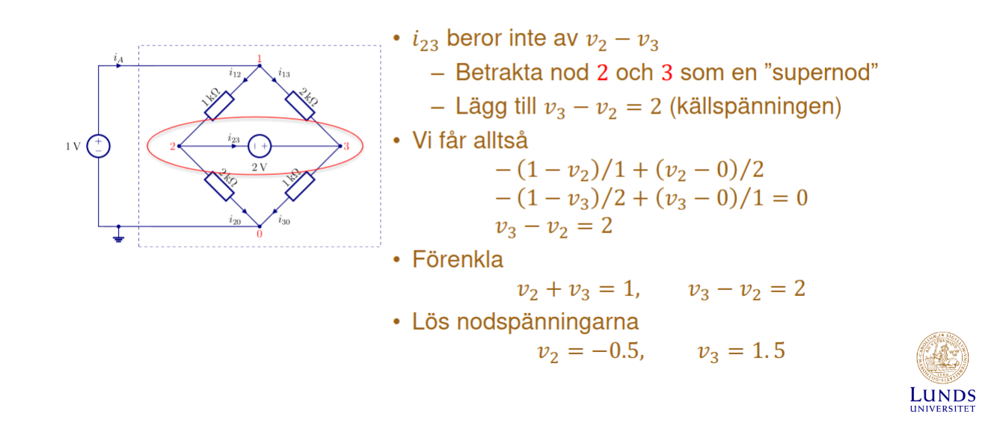

### Styrda källor
Spänningskällor och strömkällor med riktning

**Exempelvist**
om vi har ->(+ -) -2 [V/mA]
I exemplet ovan har vi nu inte v2+2=v3
- Istället har vi v3=v2+(-2)(1-v2)*1/1

Dvs räknar ut spänningsskillnaden genom att ta -2*i
där i = (1-v2)*1/1 

**Exempelvist**
Nodera om vi har ->(+ -) 2 [V/mA]
så får vi lösningen 
* v3+v2=1
* v3+v2=2

Detta är rätt räknat, men vi har kopplat konstigt, så vi får positiv återgång (dvs g ökar i, som ökar g osv)

### Ekvivalent krets med källa (lite oklart)
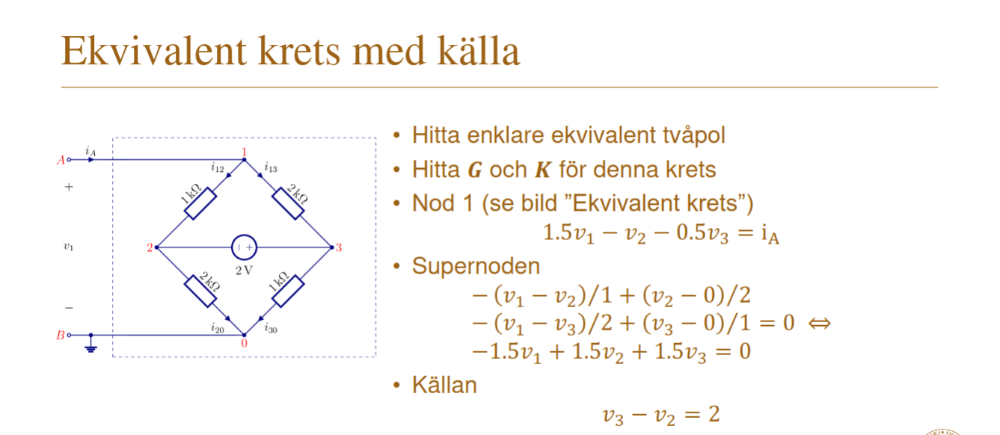

Dvs tänk att vi har iA och iB.
- Det är linjär: så vi behöver bara två punkter för att räkna ut alla

vi har punkterna (i0, 0) och (0, v0) på i mot v graf
- Där `v0` är när `i = 0`
- vi är då v = 0 dvs vi har kortslutit kretsen

Kort sagt: Alla kretser som bestär av kombination av resistanser kan vi argumentera med hjälp av en **Thevenin ekvivalent krets**:

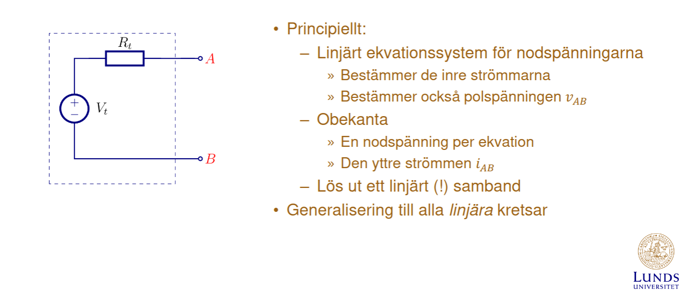
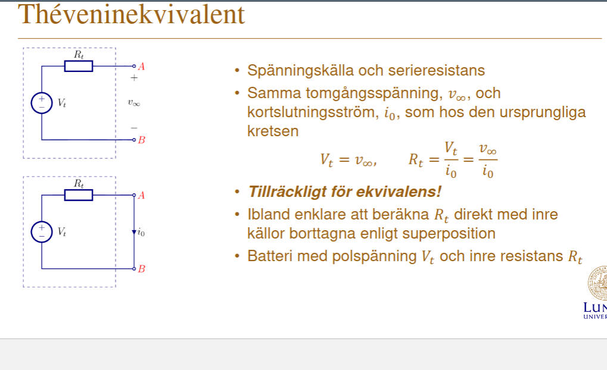

notera att lutningen på den linjära grafen bli R=v0/i0
- Så räkna enbart `v0` & `i0` tror jag
- Kan då lösa resten av punkterna med den resulterande grafen

### Recept för nodanalys
```
1. Slå samman resistanser
2. Välj noder och referensnod
3. Sätt ut nodspänningar
4. Skapa supernoder
5. Skriv nätekvationer
  1. KCL i vanliga noder och supernoder
  2. KVL för noder i supernoder
6. För styrda källor
  1. Uttryck i nodspänningar
  2. Substituera i nätekvationerna
7. Normalisera ekvationerna (matrisform)
8. Beräkna nodspänningar (invertera matrisen)
9. Beräkna strömmar och andra spänningar
```

* Generellt, fungerar alltid
* Finns ofta enklare sätt - hitta dom
* Ekvivalenter och superpositioner

---

### Generellt tips då jag hanterar kretsar 
* from what I have observed of what he has done
  
Om jag ska mäta resistansen eller spänningen mellan två punkter
- Förenkla systemet utifrån de punkter jag ska ska jämföra
- Så skillnaden mellan punkt a och b:
  - Rita a längst upp i en graf, sedan grenar, och sedan slutar i en punkt b. Så kort sagt förenklar bilden, så det är lättare att analysera

---
# Föreläsning 5
### Kondensator
```
C = kapacitans (konstant om man inte rör på kondensatorn)
q = laddning
v = spänning
```


```
i = δq/δt
q = C*v
    => i = C*δv/δt
```

**Hur mycket effekt levereras till kondensatorn eller en resistans**  

Alternativ 1:
```
p(t) = i(t)*v(t)
    => p(t) = C*δv/δt * v(t)
```

Alternativ 2: 

```
p(t) = abs(vC (t))^2/R
```

**Notera**: 
om `i = 0` 
=> `δv/δt = 0` 
=> spänningen är konstant 
(den bevaras även om strömmen stängs av)

**Hur mycket energi levereras från kondensatorn**  
- Note, denna typ av (enklare) integraler förväntas vi ha koll på

```
w(t) = w(0) + ∫p(t)dt  = ∫p(t)dt = **1/2*C*v(t)^2**
```

(w(0) = start effekten = oftast 0)
 


### Missade regeln för kondensatorer över distans

---
### Serie och parallellkopplade kondensatorer (tvärt emot resistanser - formler är tvärtom)
**parallelkopplade**
Att seriekoppla kondensatorer -> högre kapacitans
Formel: `C = C1 + C2 + ... + Cn`


**Seriekopplade**
Att parallellkoppla kondensatorer -> lägre kapacitans
Formel: `1/C = 1/C1 + 1/C2 + ... + 1/Cn`

### Att vrida tillbaka spänningen
- Ger tillbaka negativ spänning
  - Resulterar i ström åt andra hållet
    - enligt `i = C*δv/δt`

### Övning kondesatorer
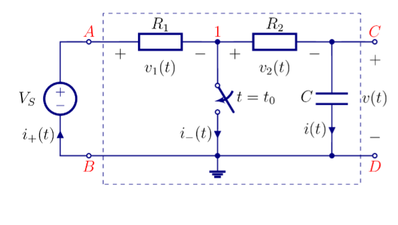

Tydliggörelse: Den X liknande grejen i mitten är en strömbrytare med en pil över (ignonera pilen)

**Kortsluten krets**
Vid `t=t0` är strömbrytaren stängd
- Blir kortslutning (kan d ignonera högersidan)
- Vi kommer tillslut får `v(t) = 0`  oberoende av vad v(0) är
  - Enligt KSV så blir spääningen över R2 samma som spänningen över C (v(t))
  - Detta leder till en ström moturs. 
    - DVS man leder ström ut ur kondensatorn
  - i(t) i `i(t) = C*δv/δt` blir negativ
    - Dvs `δv/δt` är negativ. 
    - DVS spänningen blir tillslut noll
(Överkomplicera ej. Analysera folmerna bara)

**SIDENOTE**
Den sträckade lådan kallas fyrpol
```
v_in(t) = v_AB(t)
v_ut(t) = v_CD(t)
=>

h(t) = v_ut(t)/v_in(t)
H(s) = V_ut(s)/V_in(s) -- överföringsfunktion

```


**`i(t) = C*δv/δt`** i s-domänen
I(s) = CsV(s) - V
- Poängen är: Kan räkna i s-domän och det blir enklare

**Strömbrytaren öppen**
Kan slå ihop R1 och R2
Vi får då en spänning över R: V<sub>s</sub>v(t)
- Detta resulterar i en ström medurs
- Efter lång tid kommer då v(t) gå mot V<sub>s</sub> 

Då får vi 
```
v(t) = R*i(t)
i(t) = C*δv(t)/δt
=> v(t) = -R*C*δv(t)/δt

-- löses med att räkna -R*C som konstant & V_s (tror det är startvärdet)
v(t) = V_s*e^(-t/RC)*u(t)

```
**Note**: Ofta görs benämningen τ = RC för att RC har enheten sekunder
**Note** u(t) är en stegfunktion (behövs den alltid?) 
**Note** V_s är start
**Note** C är en konstant. Behöver inte lösa för den

Todo: För att se hela uträckningen, hur vi kom fram till v(t) = V_s*e^(-t/RC)*u(t)
- se 9.7

# S-domänen
* Fungerar annorlunda med likström och växelström i beleive
## Generell Tanke
Kan överföra t-domän till s-domän

i(t) = C*δv(t)/δt
=>
I(s) = CsV(s) - V(0-)
=> räkna V genom exempelvist spänningsdelning
=> räkna sedan I(s) om det är det de söker

Lättare än alternativet att räkna I(s) = V(s)/Z(s)

* Notera att allt fungerar på samma sätt
  - Ex nodanalys finns även i S-domänen
  - Fortfarrande linjärt - superposition fungerar

* Undvik diff.ekv i t-domän
  - Kan räkna i s-domän istället

## Impedans
Generaliserar resistans till impedans
- Z(s) = V(s)/I(s)

- Z_c(s) = 1/sC

Samma regler som för resistanser gäller:
V(s) = Z_R1(s)/(Z_R1(s) + Z_R2(s)) * V_in(s)

## Överföringsfunktion
H(s) = V_ut(s)/V_in(s) -- överföringsfunktion

V_ut(s) = H(s)*V_in(s)

# MOS-transitstorn
* Förstärkning
  * Krävs överallt

* Olinjärt
  * Ofta linjärt i ett område

### Vad karakteriserar en MOS-transistor?
Antag B(ulk) och S(ource) sammankopplade

Mellan D(rain) och S(ource)
– finns Kanalen, transistorns utgående egenskap
– 𝑖_𝐷(t) = 𝑓(V_𝐷𝑆(𝑡)) inga tidsberoenden
– 𝑓 beror av dopning, geometri, samt av...
Spänningen V_𝐺𝑆(𝑡)
– Styrspänningen, transistorns ingång
– 𝑖𝐺 (𝑡) ≅ 0, med liten parasitkapacitans
– Egenskap: Tröskelspänningen, 𝑉_t

**Note**: Ex är V_DS spänningen mellan D och S 


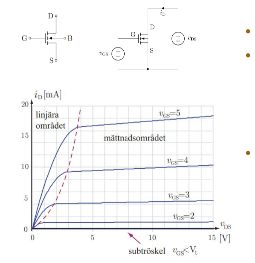

### Varför behövs förstärkning?

Inne i digitala system
* En funktion driver flera
* Återställa nivåer

Mot omvärlden
* Belasta lite
* Driva mycket

AD-omvandling
* Kunna jämföra nivåer

### Vad består kanlen av
- `kvantfysik`

- Tankemodell:
  - Elektiskt fält mellan G (+) och B (-)
  - Negativa (fåtaliga) laddningar i B dras mot G
  - När fältet blivit tillräckligt starkt
    - P-området närmast G får överskott av n-laddning
    - Som att D+kanal+S blivit ett ändra n-område
    - Det händer då V_GS > V_t

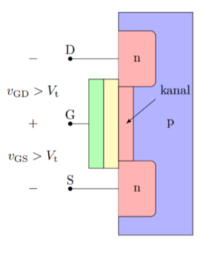

**Subtröskel (cutoff), V_GS < V_t**
* Ingen kanal
* I_D = 0
* Idealisering och förenkling
  * Bortset från ex tunnelström
  * Oftas en bra model
  * **Gäller alla modeller i kapitlet**

### Linjära området V_GS > V_t och **LITET** V_DS
* FInns en kanal V_GB ≅ V_GS i hela kanalen
  * Samma förhållanden vid D och S

* Materialegenskapen κ ≝ 𝜇_e*𝐶_ox (~50 𝜇𝐴/𝑉2)
  * 𝜇_𝑒 rörligheten (mobilitet) för elektronen
  * 𝐶𝑜𝑥 = 𝜀_0*𝜀_𝑟/t_ox
kapacitans per yta hos G
• Geometrin, L(ength) och W(idth) hos G
– 𝐾 ≝ (W/L) 1/2K = 𝑊 (W/L) 1/2 * 𝜇_e*𝐶_ox
• 𝑖𝐷 = 2𝐾 𝑣𝐺𝑆 − 𝑉𝑡 𝑣𝐷𝑆 (igen; för litet 𝑣𝐷𝑆)

### Linjära området, 𝑣𝐺𝑆 > 𝑉𝑡, 𝑣𝐷𝑆 < (𝑣𝐺𝑆 − 𝑉𝑡)
* Även kallad triodområdet
* Transistiorn är symettrisk
  * Ingen fysikalisk skillnad så S och D
  * Kanalen vid D krymper i tank med
    * Ökande V_DS -> ökande i_D
    * Ökande i:D -> ökande potential i B nära D
    * Därmed avtagande fält vid D
    * Begränsar tillväxten host i_D

* 𝑖_𝐷 = 𝐾(2(𝑣_𝐺𝑆 − 𝑉_𝑡)𝑣_𝐷𝑆 − 𝑣_𝐷𝑆^2)


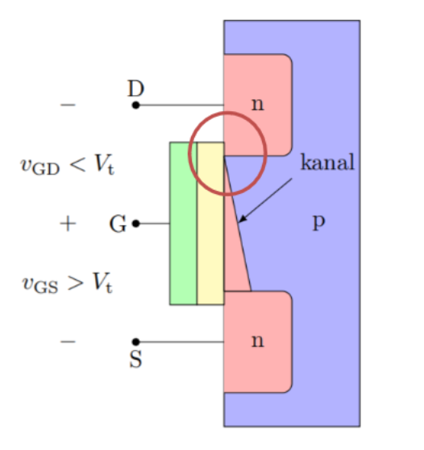

### Mättnad, 𝑣_𝐺𝑆 > 𝑉_𝑡 och 𝑣_𝐷𝑆 > (𝑣_𝐺𝑆 − 𝑉_𝑡)
* Kanalstryping (pinch off)
  * Villkoret för kanal V_GB > V_t gäller även vid D
  * 𝑣_𝐺𝐷 = 𝑣_𝐺𝑆 − 𝑣_𝐷𝑆 > 𝑉_𝑡 ↔ 𝑣_𝐷𝑆 < (𝑣_𝐺𝑆 − 𝑉_𝑡)
  * Överstigande 𝑣𝐷𝑆 över dioden D->B
* 
Ordet strypning är missvisande
* Ingen ytterligare ökning av 𝑖𝐷 (idealisering!)

𝑖𝐷 = 𝐾(𝑣_𝐺𝑆 − 𝑉_𝑡)^2

Normalt område för transistorn i
* Tillslagen digital krets
* Analog förstärkare

**Ska stå mättat område över den blåa kvadraten**


### MOS-transistion
Sida 35
https://canvas.education.lu.se/courses/22921/files/3640268?module_item_id=863541 

## Att hantera olinjära komponenter
- Forsättning på MOS
  
* Våra metoder litar på linjäritet
* Dela upp omgivningen
  * Block av linjära komponenter
  * Förenkla dessa - Thévenin
  * Kombinera med den olinjära komponenten

* Grafisk metod

* Beräkningsmässigt
  * Approximera olinjäriteten med derivatan
  * Fungerar för små variationer

### Grafisk lösning
- Förenkla omgivningen med Thevenin
- Grafisk framställning av i_D = f(v_D)
- KVG: V_t - R_t*i_D = v_D = f^-1(i_D)
  - Första likhetstecknet vår räta Load-line
  - Andra likhetstecknet på kurvan 𝑖𝐷 = 𝑓 𝑣𝐷
Rita och sök skärningspunkten

För Load-line
- Punkt A, ingen ström 𝑖𝐷 = 0, 𝑣_𝐷 = 𝑉_𝑡
- Punkt B, all spänning över R_𝑡, 𝑣_𝐷 = 0, 𝑖_𝐷 = 𝑉_t/R_t

**Exempel: Enkel NMOS förstärkare**
Behöver kurvorna för transistorn
- Datablad, 2N7000

Simulera med parametrar

Välj 𝑅 = 100 Ω
  - 𝐼_0 = 50 mA
  - varför...?
    - Kolla datablad kanske

Motsvarar den räta blå linjen

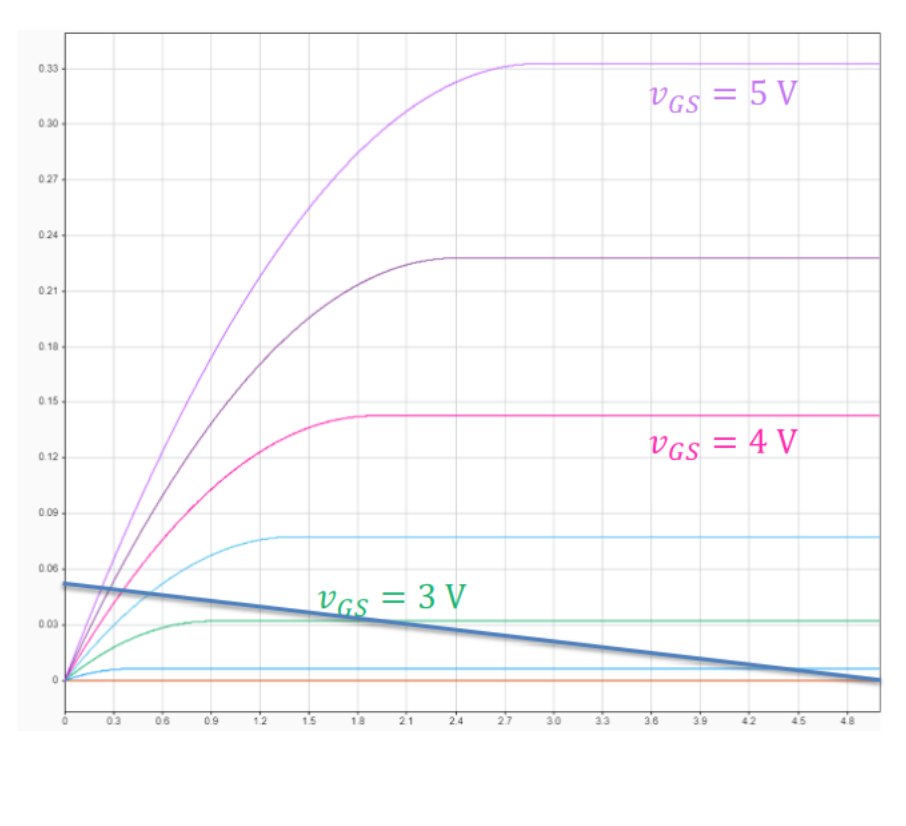

**38-43**: Oklart vad han försöker få sagt
https://canvas.education.lu.se/courses/22921/files/3640268?module_item_id=863541 


## Digitala kretsar
### Representera booleska värden med spänning
- Vanliga val:

0 = v <= V_låg; 1 = v >= V_hög

* Otillåter område 
  * 𝑉_låg < 𝑣 < 𝑉_hög
    * Det passeras vid omslag
    * Den digitala funktionen är odefinierad
    * Marginal mot störningar

**Simulerat resultat**
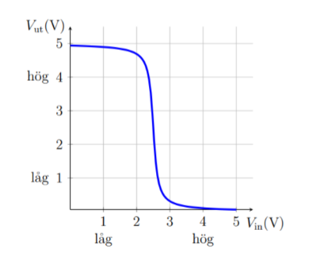

### Datablad för 74HC04
- Ingångar
- Utgångar

### H(S)
För digitala kretsar finns:
- Krav på insignalen (röda linjer)
  - Får inte vara mellan dom?
- Garantier för utsignalen(gröna linjer)
  - Kommer vara en av dom två antar jag

Överföringsfunktionen H(S) = V_ut(s)/V_in(s)
- Lutar brant (negativt för inverterare i det otillåtna området)
- Förstärkning abs(H(S)) > 1 mellan linjerna

Kan modelleras med soäningstyrd spänningskälla med g << -1
* Linjärrisering


## Grunka om förstäker

Rita in V_s = R * I_a + V_a
- Grafisk lösning "load line"
  - Blå linjen

- Läs av för 
  - Röd korsar vid (-0.5, 140)
  - Grön korsar vid (-1,5,210)
    - Ger Förstäkning g = -70

- Liknar en ivnerterare


## Inuti en CPU
### Råmaterialet kisel
- Halvledare
  - Dopas genom ersättning av atom
    - N-typ, elektronöverskott, ofta Fosfor
    - P-typ, elektronunderskott, ofta Bor
    - Koncentration 1013 − 1018 cm−3

### n-kanal MOSFET
Normalt 𝑉𝐵 = 0 övriga 𝑉 ≥ 0
– Alla ”dioder” blockerar

Gatespänningen 𝑣𝐺𝐵(𝑡)
– Styr Drainströmmen, 𝑖𝐷𝑆(𝑡)
– Ledande kanal D till S

Storlek = längden L
– 1971: ~10 μm
– Nu: ~10 nm

106 fler transistorer/yta

### Massor om CPU:er oklart om det är viktigt. Sida 20 och framåt
https://canvas.education.lu.se/courses/22921/files/3640268?module_item_id=863541 

### CMOS-inverteraren
Allt på ett substrat (p-dopat)

PMOS in n-ficka/brunn/grop

Nodspänningar
- Nära V_DD (matning): Logisk etta
- Nära V_SS / Gnd (jord): Logisk nolla

Hög förstärkning
- Inverterande
- Omslagspunkt nära V_DD/2
- Återstället signalnivåer till digitalt

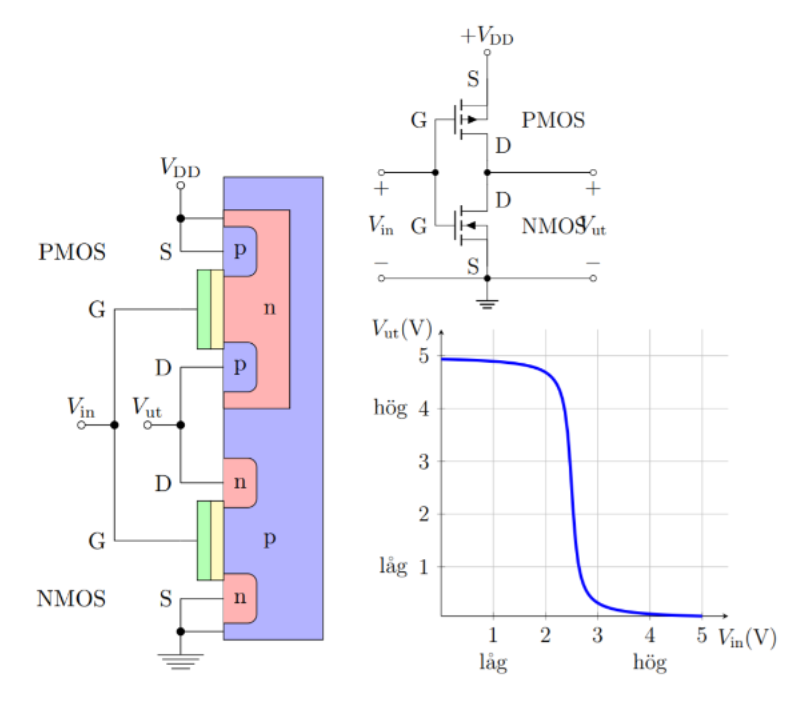

### Simulering med CMOS
Ersatt 𝑅 med PMOS

Diagram, 𝑣𝑑𝑠 mot 𝑣𝑔𝑠

Överföringsfunktionen
- Perfekt omslag
  - 𝐾𝑝 = 𝐾𝑛
- Drar ”ingen” statisk ström

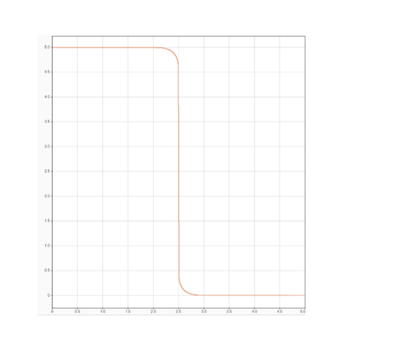

### MOS-transistorn som strömbrytare
Alltid ena transistor i subtröskel
– Aldrig ström direkt 𝑉𝐷𝐷 → Gnd
– Styret kapacitivt
– Ingen statisk strömförbrukning!

Andra transistorn i mättnad
– Hög strömförmåga (litet 𝑅 ut)
– I förhållande till 𝐶 hos styret
– Processberoende, kΩ och fF
– Grindfördröjning ~100 ps

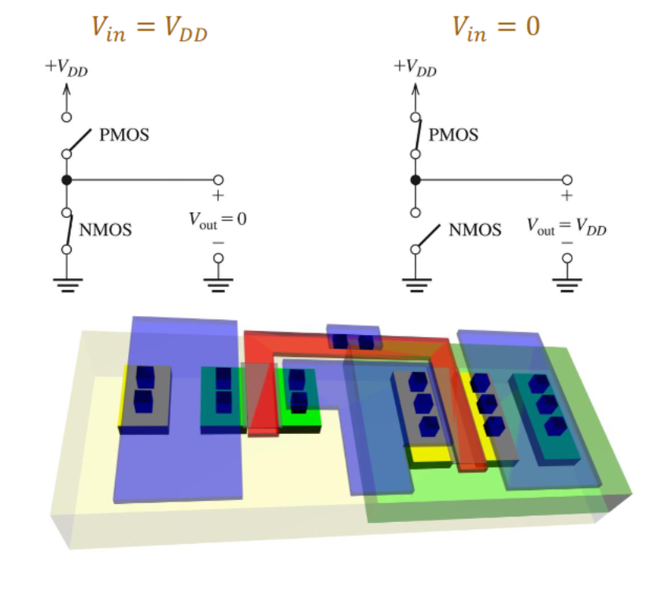

# Föreläsning 8

### CMOS NAND-grind
Varje ingång påverkar
– Två transistorer
– Parallell / Serie
– Ena sidan leder alltid
– Lätt öka antal ingångar

Från digitaltekniken
– NAND-grinden universell

Hur kan man göra AND?

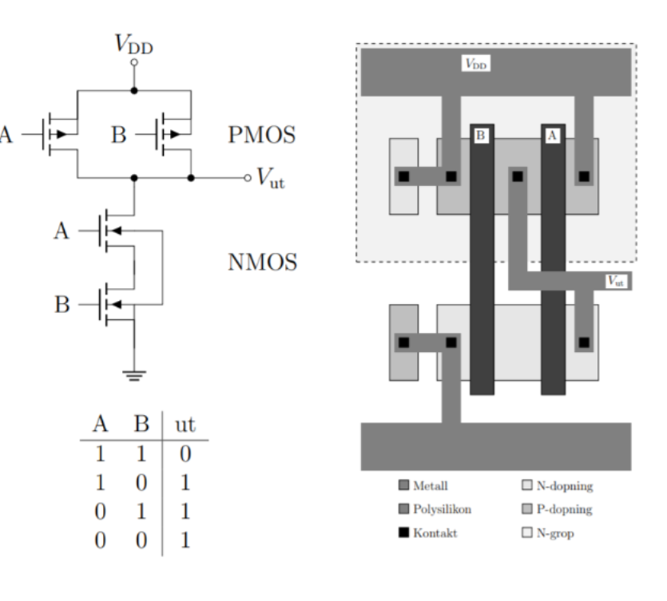

## Signaler 
- täcks inte av kursboken. Enbart kompendiumet
## Digititala domänen
- Kostar mindre
- Mindre hot att den störs

### Analogt till digitalt
- Heltal till realvärd
- Diskret till konturnuelig

**Antiviknignsfilter - sampling - kvantisering - kodare**

### Digitialt till analogt
- Realvärd till heltal
- Konturnuelig till diskret

**Omkodare - sample and hold - rekonstruktionsfilter**
(han förklarade ej dessa)

### Antivikningsfilter
  
### Sampling
Tittar på signalen vi vissa ögonblick

Tiden:
- Kontinuelig till diskret
  - Fortfarrande analoga värden

Om vi föjer Nyquist theorem så kan vi göra sampling utan informationsförlust
- om frekvens av sampling > 2 * frekvensen av signalen

### Kvantisering
Välj ett antal bitar och avrunda talen till det
- Påverkar precision

Vi får (2^n) - 1 nivåer
- står konstigt med 2^n i kompendiet
- 
### Kodare
- En möjlighet att överfära tal (tittar inte på det i kursen)
  - Ex vi vill ta varje 3 tal och göra ett decimaltal i guess

### Brus
- Lättare att tolka en digital signal som har blivit påvekar mot brus
  - Jämfört med analoga
    - För man vet hur de borde se ut: Dvs bara 0:or och 1:or

## Spektumanalys
- Alla reella periodiska signalen kan beskrivas med en funktioner a(t) 
- - a(t) består av ett antal cos() funktioner och konstanter

Uppdelning med fourieranalys
- kan beräknas efektivt numeriskt med DFT
- Analysera varje frekvens för sig
  - Sätt samman enligt superposition

Ett spektum är en samling av signaler

Finns ett trick där vi kan ... 

### Gradering av spektumdiagramet
- Mer behagligt att gradera spektumskalan i decibel

Logaritmisk magnitudskala, definition  
`abs(H(jɷ))dB = 20log_10(abs(H(jɷ)))`

- Enhetslös, kvnot mellan spänningar

 När dB används i effektskalor (pratar om effekt) gäller:
 - `10log_10(p1/p2)`
   - Detta är 1/100 av spänningen för det förhåller sig kvadratiskt 

## Periodiska signaler och effekt
Ögonblciseffekt vet vi är
```
p(t) = v^2(t)/R
```

Energi per period T
E_T = 1/R integral(from 0 to T, V^2(t) dt)

Ger medeleffekt
P = E_T/T = 1/T*1/R integral(from 0 to T, V^2(t) dt)

### Effektivvärde
Innebär att en periodisk spänning eller ström levererar samma effekt i en resisistans som en konstant sådan med samma värde
- Så 240V är effektivvärdet

* Se bild från 25/4

**För sinusvåg**
Beräkna effektivvärde:
V_rms = V/√(2)

där V_rms är effektivvärde

**Trekantvåg**
V_rms = V/√(3)

**Kvantiseringbrus**
- Uppstår pågrund att vi inte har oändligt många nivåer

Om vi lägger en signal som varierar med tid
- Kan beräkna snitteffekten för bruset: 
  - `C*N+a`
    - Där C och a är konstanter
    - N är antalet bitar (som ger uppstånd till bitar)

# Föreläsning 9 
## Fortsättning sampling
### Att återställa en samplad signal
- Vi har en samplad signal
  - Vi vill återställa den till en kontinuelig signal
    - Vi vill ha en kontinuelig signal som är så lik den ursprungliga som möjligt
- Interpolera
  - Fyll tidsintervall från sampel
  - LP-filtrera
    - Varför?
    - För att få bort högfrekventa komponenter?
    - För att få bort samplingseffekter?

### Undersampling
- Om vi har undersamplat dvs f_s < 2 * f_sig
  - Kan inte säkerställa att vi kan återställa 
  - Kan få aliasing

### Aliasing
- Aliasing är när resultatet av samplingen inte är unikt
  - Dvs vi kan få samma resultat av två olika signaler
    - Dvs vi kan inte återställa signalen
- Undviks om vi inte undersamplar
- Vår återställda signal kommer inte vara den orginella

- Exempel: f_s = 10, f_Blue = 2, f_Red = 12

- En extra period mellan punkterna
  - Signaler med f_n = n × f_s + f_blue
  - Oskiljbara från f_blue

### Aliasing och fasläge
- Samplingen har ingen inforamtion om fasläget
  - Dvs vi kan inte återställa fasläget

- DVS om vi samplar för långsamt kan det se ut som den återställda funktionen är fasförskjuten jämfört med den orignella

- Samtliga spegelfrekvenser till 𝑓_Blue är oskiljbara från 𝑓_Blue
  - 𝑓_𝑛 = 𝑛 × 𝑓_𝑠 ± 𝑓_Blue

### I spektrumform

1. Signalens spektrum, max 𝑓_𝐵
    - Hur hög den högsta frekvensen är antar jag?
    - Negativt spektrum, komplexkonjugat
    - Ingen information  

2. Sampla med 𝑓_𝑠 > 2 ∗ 𝑓_𝐵
    - Återställs med LP-filter; 𝑓_0 ≅ 𝑓_𝑠/2  

3. Med 𝑓_𝑠 < 2 ∗ 𝑓_𝐵
    - Vikning, 1 och 2 glider ihop
    - Kan ej återställas

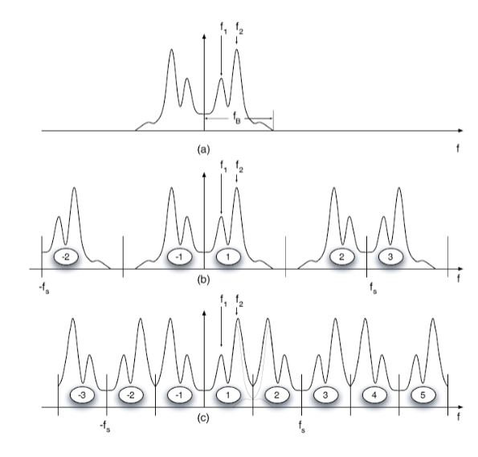

### Antivikningsfilter
Måste eliminera störningar med 𝑓 ≥ 𝑓_𝑠 − 𝑓_𝐵
-  Viks ner i den nyttiga signalens spektra
- Kan inte skiljas ut på digitala sidan
  - Nödvändigt, analogt filter
  - Störningar med 𝑓𝐵 < 𝑓 < 𝑓𝑠 − 𝑓𝐵 kan filtreras digitalt
  - Skäl att välja 𝑓𝑠 ≫ 2 ∗ 𝑓𝐵
- Minskar kraven på antivikningsfiltret

### Krav på antivikningsfilter
- Nyttiga signalen
  - Liten och jämn dämpning
  - Då 𝑓 < 𝑓𝐵
- Störningar som viks ner
  - Till frekvenser 𝑓mirror < 𝑓𝐵
  - Dvs med 𝑓 ≥ 𝑓𝑠 − 𝑓𝐵
  - Dämpas minst 𝐴𝑆𝐵
- Lutning ASB = 𝑓_𝐵 / 𝑓𝑠−2𝑓𝐵
  - Snålt 𝑓𝑠 → brant filter
  - Högre ordning

### Intervaller och intervallgränser
- **Så som jag har uppfattat det:**
  - Intervallet är trappstegen se bild 13 under titeln "exempel ideal A/D omvandlare"
  - Intervallgränserna är trappstegens kanter
  - LSB är trappstegens höjd 
  - V_LSb står för vad LSB är i volt
  - V_fs står för vad fullskala är i volt
  - N är antalet bitar


* Är 𝑉𝐿𝑆𝐵 = 𝑉fs/2𝑁 eller Τ𝑉fs 2𝑁 − 1 ?
  - Vi väljer det senare!
    - Varning, blandat i materialet(!)
    - 𝑉fs = (2𝑁 − 1)𝑉LSB går att representera
    - Naturligt med Flash-omvandlare
      - **𝑉_𝐿𝑆𝐵 = 𝑉fs / 2𝑁 − 1**

### Ideal A/D-omvandlare
- Omvandlar en kontinuelig signal till en diskret signal
- Ideala A/D är helt linjära tror jag
- Tror även m=0

- LSB står tydligen för analog output value enligt en slide.
  - Står det inte för least significant bit?


### Exempel Ideal A/D-omvandlare
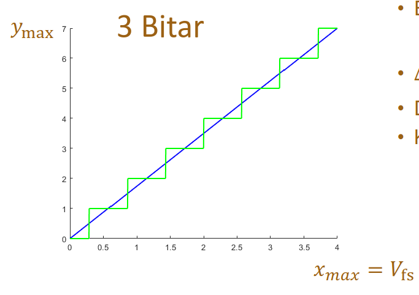

Exempel med 
- 𝑁 = 3 (3 bitar)
- 𝑉fs = 4
-  Insignal 𝑣 ∈ ℝ, 𝑣 ∈ 0, 4  

  ---

-  Δ = 𝑉_LSB = 𝑉fs
- 2𝑁−1 ≈ 0,57 V  
• Digitalt 𝑦max = 2𝑁 − 1 𝑉LSB  
• Kurvanpassning 𝑦 = 𝑘 ∗ 𝑥 + 𝑚 → 
  - 𝑘 = 2𝑁−1  / 𝑉fs = 7/4 = 1,75
  - 𝑚 = 0

### Icke-ideal A/D omvandlare

**Offsetfel**  
Försjutninging av kurvan/Parallellförskjutning
- Offset
  - Förskjutning i x-led
- I 𝑉LSB eller mV


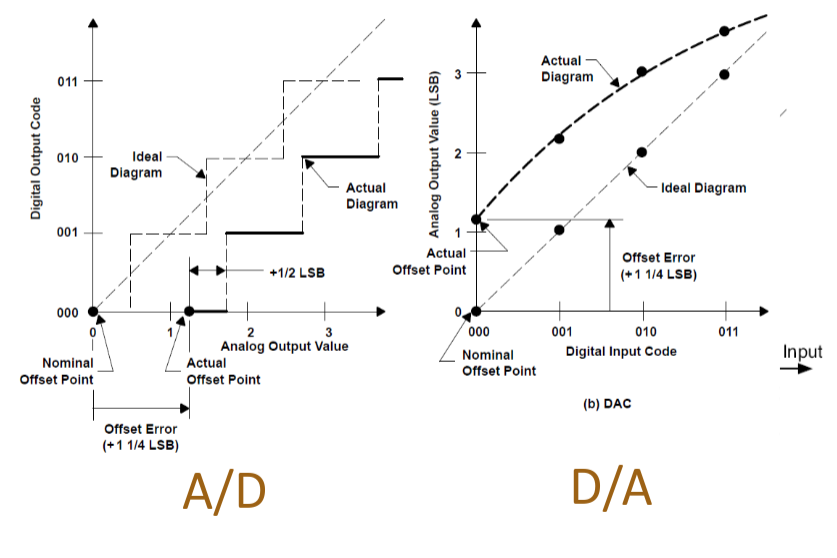

**Lutningsfel**
Lutningsfel
- Felet i 𝑘
- I 𝑉_LSB vid max 𝑦
- Avvikelse i %

### Mäta upp felen, tabell med godtyckliga värden
- Mät upp punkter på den verkliga gröna kurvan
  - Osäkerhet: intervall avbildas på heltal dä
  - Finns ett antal utspridda punkter
    - Undvik svansen

- Anpassa kx+x (minsta krvadrat metoden), gul linje
  - k1 = 2.09
  - m = -0.56

- Förstärknignsfel i % 
  - 2.09-1.75/1.75 = 19.4%

- Nollpunktsfel i V (m1 är på X axeln)
  - -0.56/2.09 = 0.27V

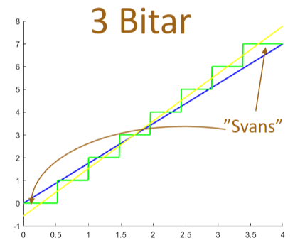

### Mäta upp felen, söka upp övergångar
- Sök upp övergångar hos verkliga gröna kurvan
  - Tror han syftar på att man vill hitta då gul går rakt genom en punkt på den gröna
  - Typ som "sök upp"
- Hitta minst två språng
  - Mitt i stegen, på gula linjen
  - Antag att värdet slår om q -> q+1
  - Avrundande omvandlare, 𝑘𝑥 + 𝑚 = 𝑞 + 0.5
- Exemplet: (0.51, 0.5) och (3.41, 6.5)

- Två punkter, lös ut 𝑘 och 𝑚
  -  Med endast förstärknings- och nollpunktsfel
  - Mycket noggrant

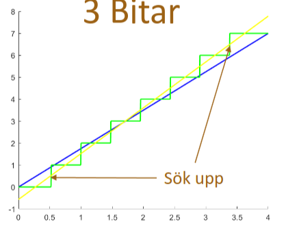

### Övriga fel i överföringsfunktionen
- Linjäritetsfel
  - Den heldragna linjen

- Kvarstående avvikelse
  - Efter korrigering för offset- och förstärkningsfel
  - Komponentfel, olinjär förstärkning...

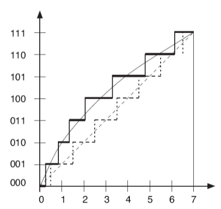

### Yttligare felkällor, Jitter
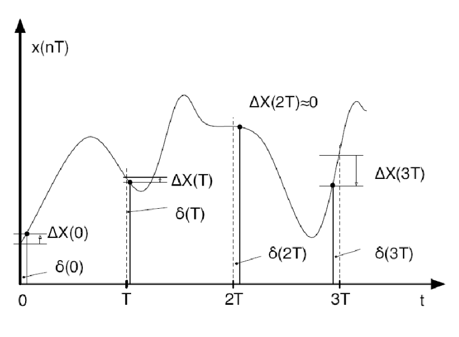
- Vi har avvilker i tiden (pga av jitter) vilket gör att vi sa,plar delta(nT) bort. 
- Om vi har insignal x(t) så kommer skillnaden i x(nT) (y-axeln) bli delta(nT)x'(nT) (x-axeln)

Tolkat från: 
Små tidsavvilkeser delta(nT) i samplingen
Med insignal x(t) 
- Samplingsfel DELTAx(nt) approx = delta(nT)x'(nT)
- Feleter ökar med delta och w
  - Utmaning för HF-tillämpningar


## Hur bygger man en omvandlare  
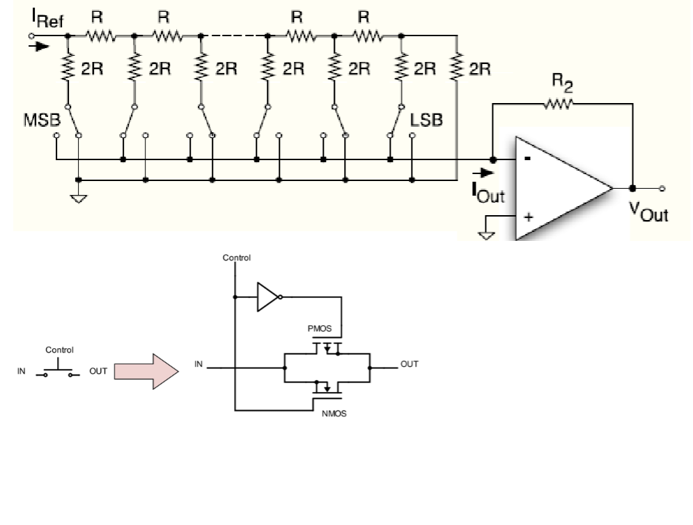

- A/D i detta fall?? eller båda hållen?

1. Brytare 
  - Mot 0V, ensam NMOS
  - (annars) Par av NMOS och PMOS

2. Komparator och förstärkare
  - Operationsförstärkare (komparatorn)
  - 10 - 100 transistorer

### Operationsförstärkaren (komparatorn)
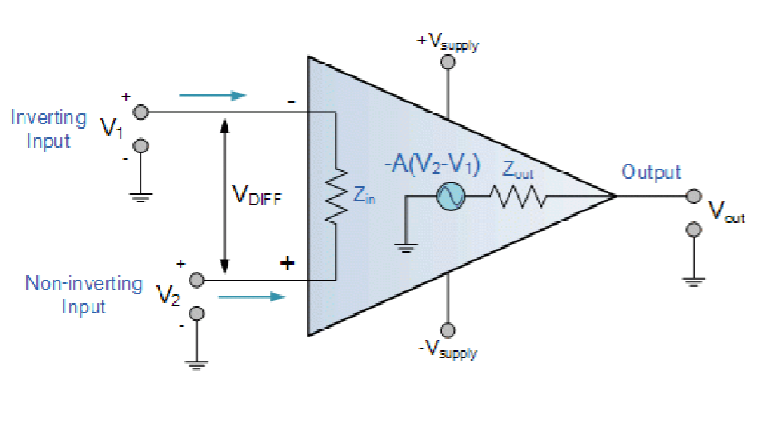

* Ideal operationsförstärkare:
  - Z_in -> oändligheten
    - MOS-styre, > MΩ
      - Vilket betyder att vi har en MOSFET som är i cut-off enligt copilot

  - Z_out -> 0
    - MOS-kanaler mΩ - Ω
      - Vilket betyder att vi har en MOSFET som är i triode enligt copilot

    - V_out = A(V_2 - V_1)
      - Konstant A -> oändligheten
      - I praktiken 10^3 - 10^4
      V_out är begränsad av matningen

### Operationsförstärkaren inuti
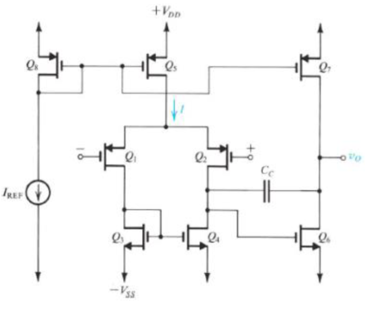
- Enklaste grundform i CMOS
- 8 transistorer + minst en för I_ref
- Strömspegel 1 (Q_8 och Q_5)
  - Håller I konstant (ungefär I_ref)
- Strömspegel 2 (Q_3 och Q_4)
  - Håller I_Q1 = I_W2
  - Förstäker V_+ - V_-  till V_gs på Q_6
- Utgångsförstärkaren Q_6
  - R_D motsvaras av Q_7

### Enklaste D/A-omvandlaren
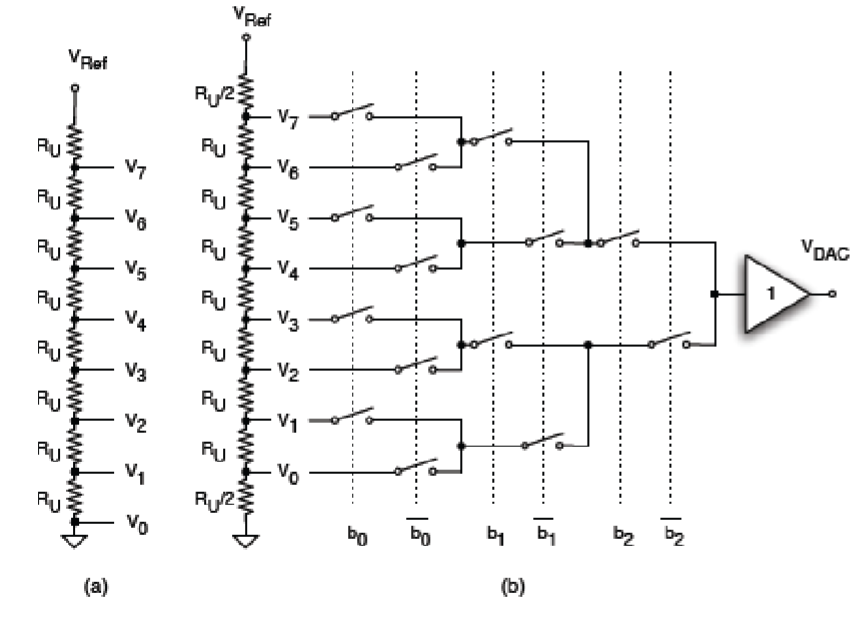
* Enkel och vanlig lösning (få bitar)
  - N bitar kräver 2^N resistanser

a) Alla resistanser är lika med R_U
  - V_DAC = V_ref * i / 2^n
  - DAC är förkortning för D/A-omvandlare DA converter

b) Överst och nederast, R_U / 2
  - V_DAC = V_ref * (i+1/2) / 2^n
  - Ideal överföringsfunktion!

### D/A med R/2R-stege
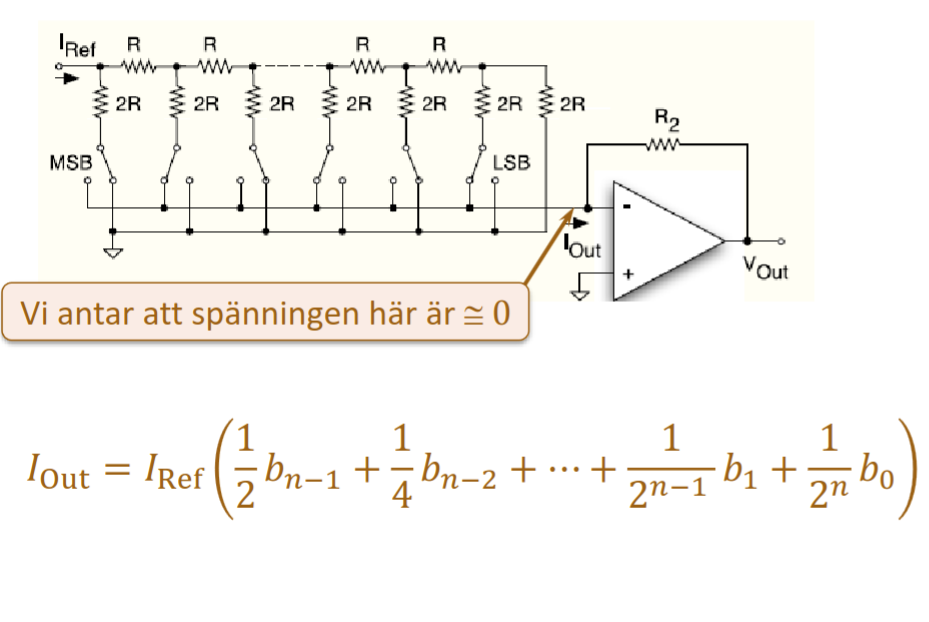
* För varje nod i övre kedjan
  - Direkt efter varje R
  - R_eq åt höger = R = 2R / 2R

* OP-förstärkaren
  - Hög förstärkning
   V_out ställer in sig så att 
    - Strömmen i R_2 balanserar I_out 
    - V_out approx = -I_out * R_2

### D/A med kapacitiv spänning
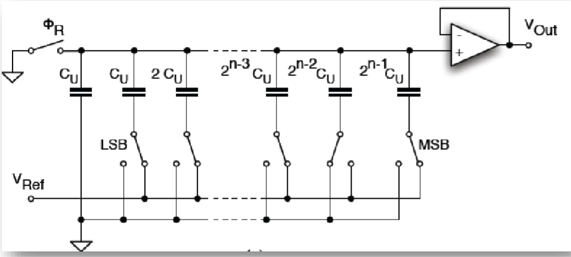
* Med brytaren sluten
  - Ladda ur C_U till vänster
  - Ladda C_eq till V_ref
  - C_eq = SUM( b_i * C_U * 2^i )
    - Viktad bitsumma

* Då brytaren öppnad
  - Dela V_ref kapacitivt mellan
  - C_U till vänster och C_eq

### D/A med strömkällor
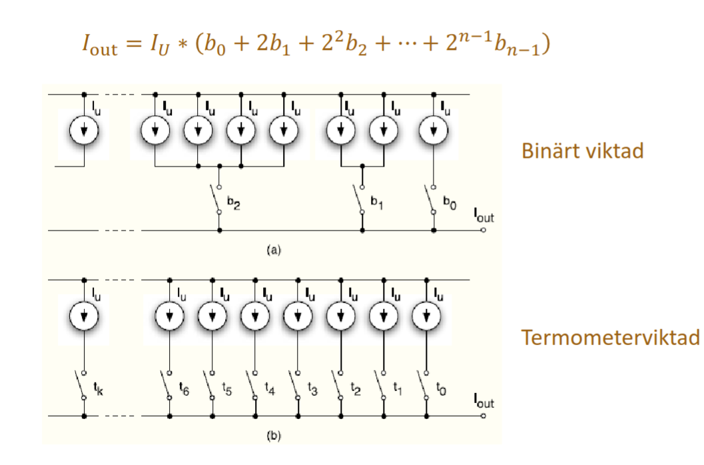
* I integrerade kretsar
  - Strömkällor är enklare att bygga än R eller C
    - "Billigare" än R eller C
  - Strömkälla = 1 transistor


## A/D-omvandlare blockschema
- Ett blockschema är en grafisk representation av ett system som består av olika block som är sammankopplade med varandra.

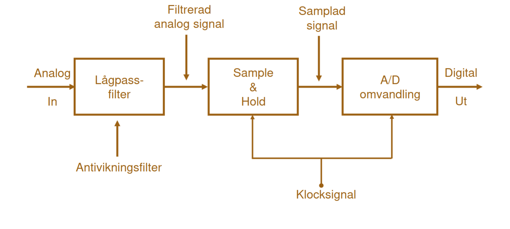

### Sample and hold 
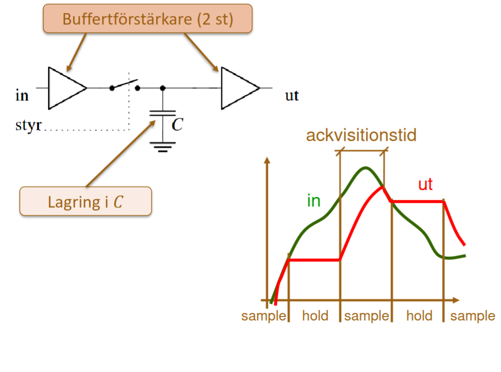

* Under omvandling måste den analoga signalen vara stabil
* "Fångas" ofta i en kondensator
* Bufferförstärkare:
  * Förstärkning = 1
  * Stort Z_in, litet Z_out
  * Enkelt i CMOS
* Oftast inbyggt i A/D-omvandlaren

### A/Domvandlare överssikt
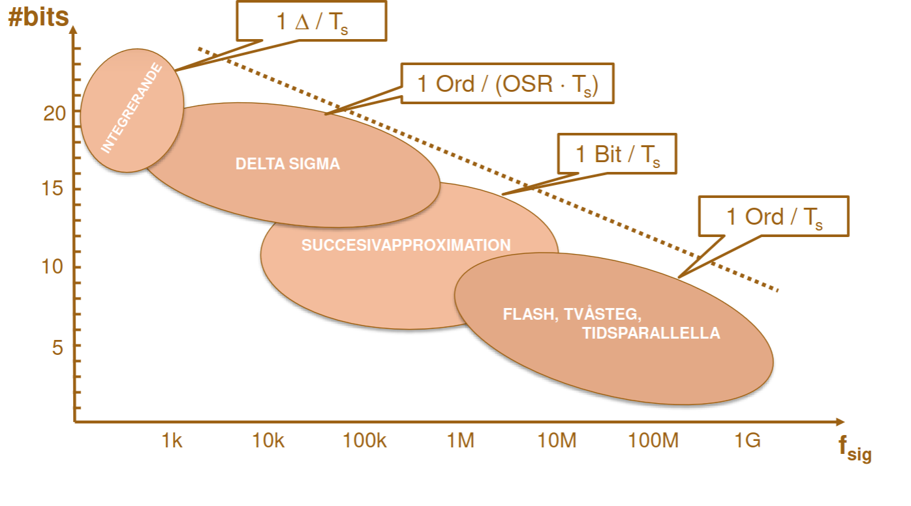

Tror detta är en jämförelse mellan olika A/D-omvandlare
- f_sig är frekvensen på signalen
- bits är bits

### Flash A/D omvandlare
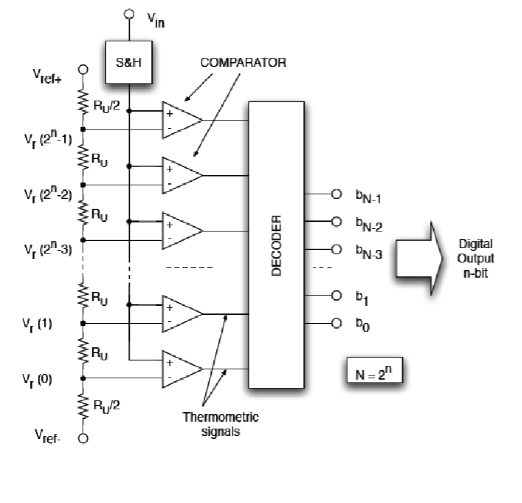

* Snabb
* Resurskrävande
  - #Komparatorer = 2^N - 1
  - Små N, eller flera steg (se bild)

* Omvändningen av första D/A lösningen

### A/D i flera steg
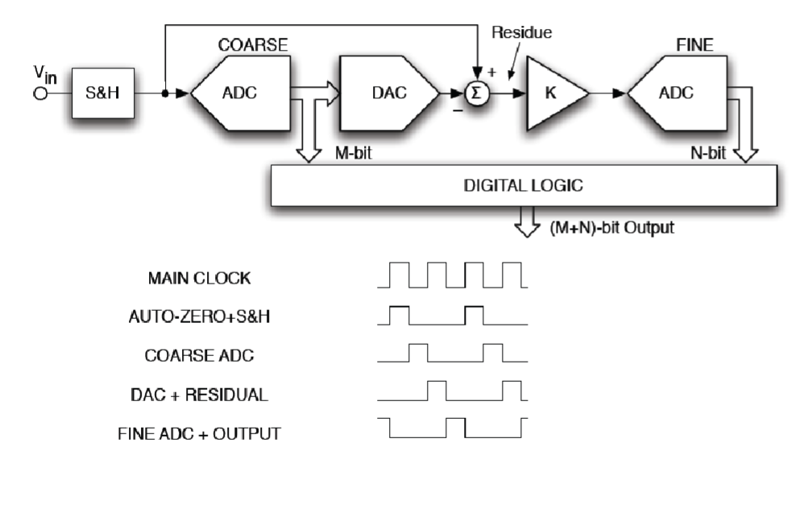

* Flera steg, mer fördröjning
  * FLer klockcykler

* Princip: Använd D/A i A/D
* Exempel 8 bitar, 2 flashsteg
  * Antal komparatorer
    - 2 * (2^4 - 1) = 30
    - Jfr direkt 2^8 - 1 = 255
    - Tror han försöker säga att det är färre kompratorer??


### Tidsmultiplexad A/D omvandlare
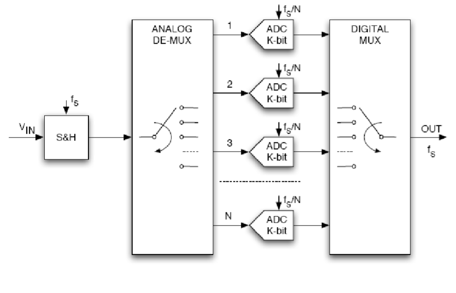

* N st A/D-omvandlare
  - Turs om i tidsordning
  - Total samplingfrekvens = f_s
  - I varje A/D räcker f_s/N

* Sample and ohold i full hastighet, f_s
* Vanligt i HF-sammanhang

### 10G Ethernet, A/D för mottagare
* Moderna nätverk är inte så digitala på tråden
* Lös av signalen med A/D och avkoda digitalt

### A/D med successiv approximation
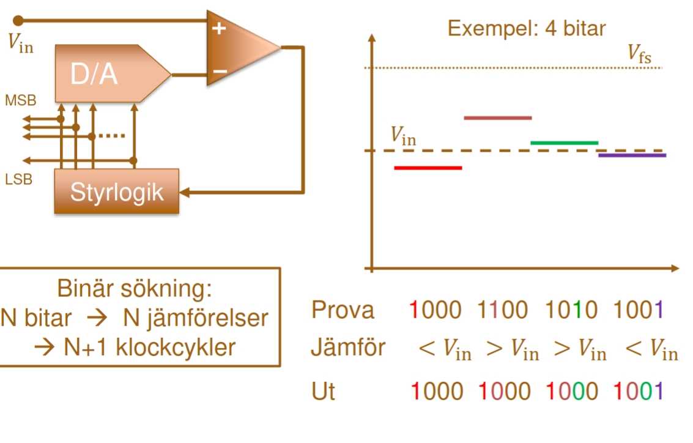

* Vanlig omvandlare
  - Effekt-snål
  - Bra upplösning
  - God hastighet

* Ofta med kapacitiv D/A-omvandlare

### Integrerande A/D-omvandlare
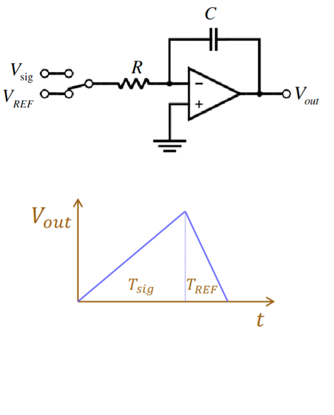

* OP:n som integrator: v_out(t) = 1/RC * integral(0->t, v_in(t)dt)
* Vi mäter tid istället för spänning
1. Med brytaren mot V_sig i T_sig = 2^N * t_clk
  - Då V_out = v_sig * (2^N * t__clk) / RC

2. Med brytaren mot V_ref tills V_out = 0
  - Räkna till k klockcykler dvs T_ref = kt_c
  - Då V_sig / V_ref = k / 2^N, dvs k är digitala värdet

* Noggrant och långsamt


# Analogt
## Digitala kretsar
### Representera Booleska värden med spänning

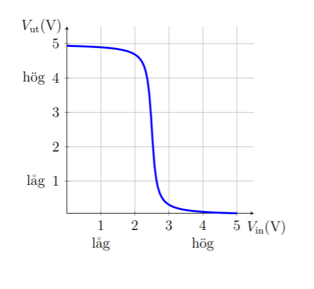


* Vanliga val är att:
  * `<=` v_låg represesenterar 0
  * `>=` v_hög representerar 1

* Otillåtet område mellan v_låg och v_hög
  * Paseras vid omslag (tänk kapacitans)
  * Den digitala funktionen är odefinierad
  * Marginal för störningar

### Ur datablad för 74HC04, tålighet
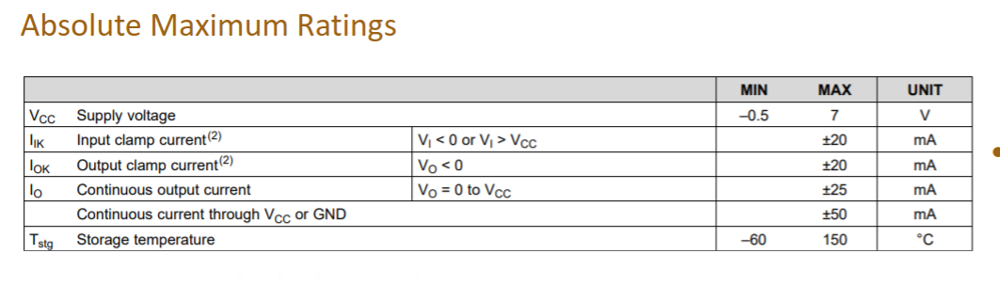

* Tabellen definierar de
gränser som gäller för att
inte förstöra komponenten

* Användaren av kretsen
måste garantera dessa
villkor

* Normalt krav
0 ≤ 𝑣𝑖𝑛 ≤ 𝑉𝑐𝑐

### Digitala kretsar, CMOS-inverteraren
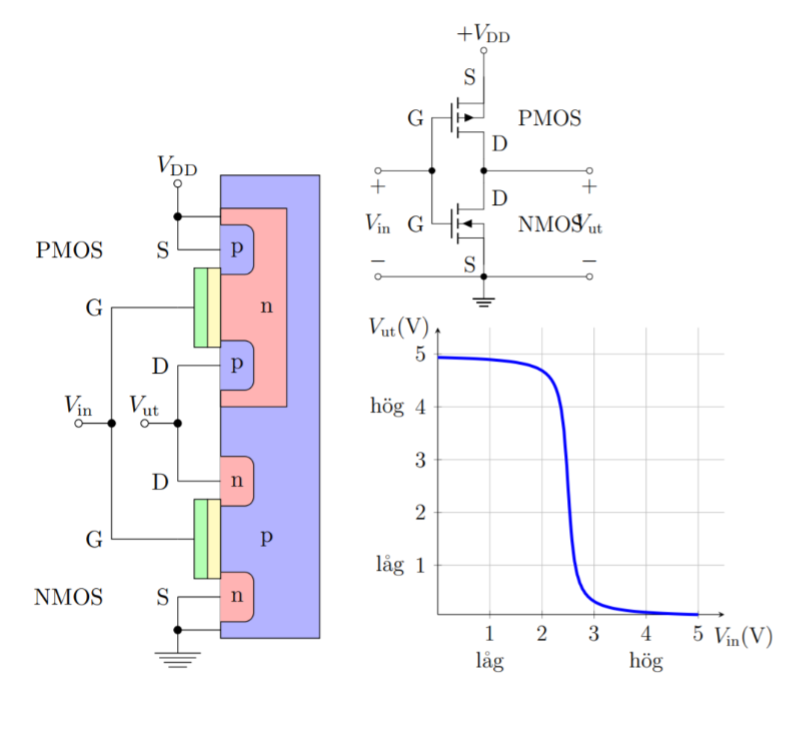

Tunn gateoxid ger
* Snabba, effektiva transistorer
* Förstörande genombrott 𝑉𝑖𝑛 ≳ 10 V

Dopning påverkas (förstörs) av värme
* Höga strömmar
* Felpolarisering av PN-övergångar
* Bristande kylning

## Induktans
* Fungear som kapacitans - fast tvärt om
  * B-fält i stället för E-fält som energilager 

* Mäts i Henry (H)

* Spänningen:
  * v(t) = L * di(t)/dt
    * Notera att om vi har en spänning över en induktans så kommer strömmen att öka linjärt, dvs över lång tid är den oändlig, dvs v(t) noll

* Lagrad energi:
  * W = 1/2 * L * i(t)^2

* Dvs konstant spänning kräver ständigt ökande ström


### Effekt och energi - exempel
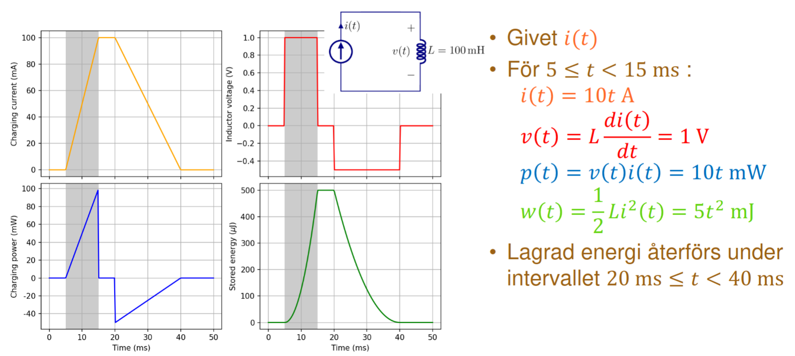

### Plötsliga förändringar
Kapacitans:
* Samband 𝑖 𝑡 = 𝐶 𝑑𝑣(𝑡) / 𝑑𝑡
  * Kan ha språng i ström, trög i spänning
  * Till-/frånslag vid t = t0 -> v(t_0-) = v(t_0+)

* Induktans
  * Samband 𝑣 𝑡 = 𝐿 𝑑𝑖(𝑡) / 𝑑𝑡
  * Kan ha språng i spänning, trög i ström
  * Till-/frånslag vid t = t0 -> i(t_0-) = i(t_0+)

### Kapacitans och induktans
Modeller, dvs idealiseringar/förenklingar

* Enkla samband mellan spänning och ström
  * Generellt
𝐷(𝛼𝑓(x) + 𝑔(x)) = 𝛼𝐷𝑓(x) + 𝐷(𝑔(x))

Kondensatorer och spolar kan ofta betraktas som
rena kapacitanser eller induktanser, men...
* Har förluster
* Tål inte alla spänningar och strömmar

### Verkliga kondensatorer och spolar
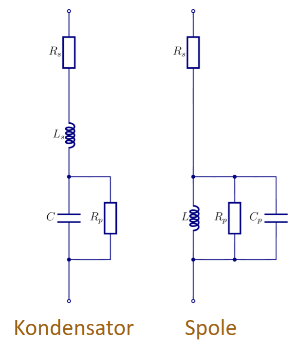

Alla verkliga komponenter har:
* Lite resistans, 𝑅𝑠, i serie
  * Resistans i anslutningarna

* En (stor) resistans, 𝑅𝑝, parallellt
  * Läckage genom isolatorer

* Lite extra
  * Induktans, 𝐿𝑠, i serie
  * Kapacitans, 𝐶𝑝, parallellt
  * Finns fysikaliskt överallt

### Relä
* Princip
  * En spole ger magnetfält
  * Magneten drar ankaret
  * Ankaret slår om kontakt

* Liten ström i spolen
  * Påverka stor ström

* Alla storlekar
  * Isolerar spole – kontakt
  * Induktiv och långsam


### Att driva ett relä
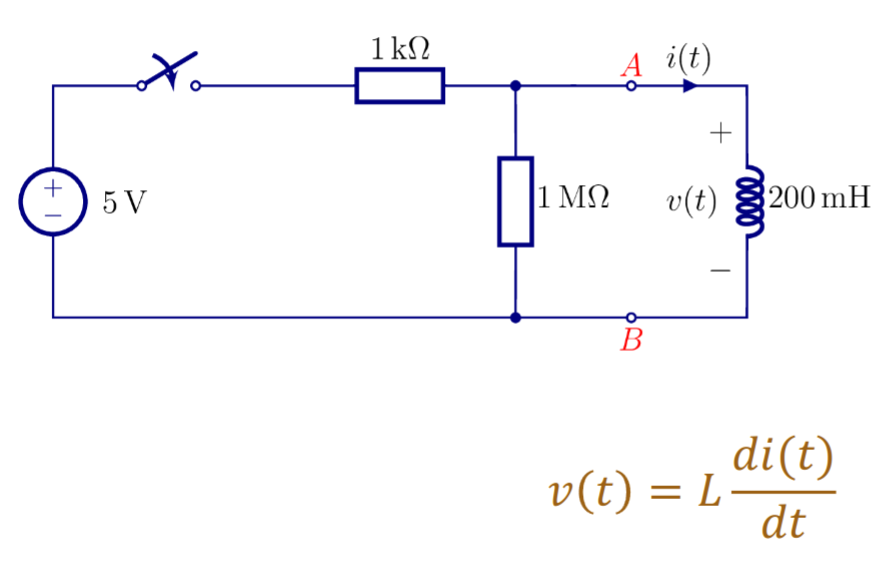
Mycket enkel modell av en
digital krets som driver ett relä

* Ström genom spolen genererar
magnetfält som påverkar en
kontakt

* Matningsspänning 5 V och
brytaren = en MOS-transistor
som bara tål den spänningen

* Vad händer vid till- respektive
frånslag?

**Tillslag**
* Slut brytaren vid t = 0
* Strömmen före i(0-) = 0
* Strömmen kan inte ändras momentant i(o+)=0
* Efter en lång tid v(oändlighet) = 0
* Ger i(oändlighet) = 5 mA
* Inga problem här!

**Frånslag**
Öppna brytaren vid 𝑡 = 0
* Strömmen före 𝑖 0− = 5 mA
* Strömmen kan inte ändras
momentant 𝑖 0+ = 5 mA
* Ger 𝑣 0+ = −5 mA ∙ 1 MΩ = -5000 V
* Yikes! Transistorn brann upp!
  * Aldrig induktiv last utan skyddskrets!

### Enkel lösning som skyddar
Dioden (idealiserad)
* Oledande för 𝑣 𝑡 > 0
* Kortslutning, hindrar 𝑣 𝑡 < 0

Verklig diod
* Begränsar 𝑣(𝑡) nedåt till c:a −0.7 V
* Tar över strömmen från 1 MΩ-
resistansen

### Impedans
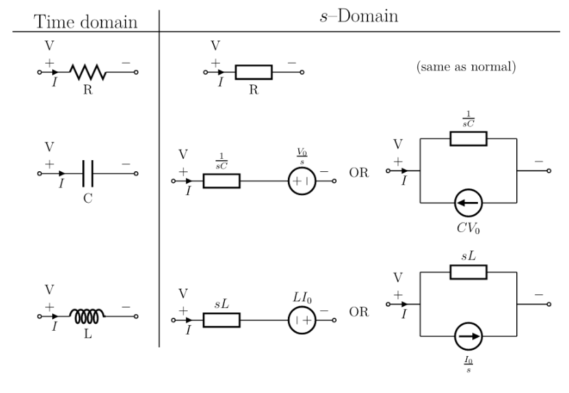
Laplacetransform av v(t)/i(t)
* Sätt v_0 = 0
* Kompensera med källan 

Överför differemtialekvation i(t) till algebra i(s)

Linjära samband med parameter t ger li jära samband med paramter s

Använd nodanalys

### Tidsförlopp, beräkna 𝑣(𝑡) för 𝑡 ≥ 0
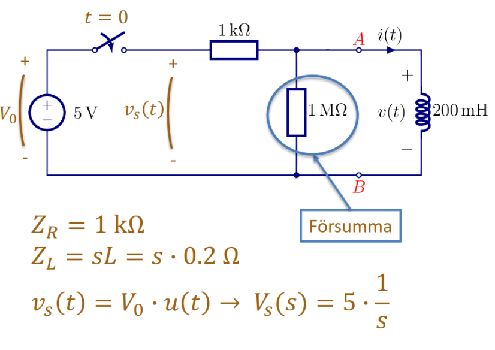
* Spänningsdelning ger
  * H(s) = Z_L / (Z_R + Z_L) = s / (5000 + s)

* Utsignal i s-planet 
  * 𝑉 𝑠 = 𝑉_s(s) * 𝐻(s) = 5 / (5000 + s)

* I tidsplanet
  * v(t) = V_0 * e^(-5000t)

* Med tidskonstant 𝜏 = L/R = 0.2 ms
  * v(t) = v_0 * e^(-t/𝜏)

### Signaler från/till omvandling
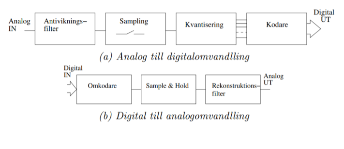


A/D-omvandling
* Antivikningsfilter / församplingsfilter

D/A-omvandling
* Rekonstruktionsfilter

Båda är LP-filter
* Bygga och beräkna?
* Vet redan, arbeta i s-planet!
* Förenklade metoder

### Generell lösning
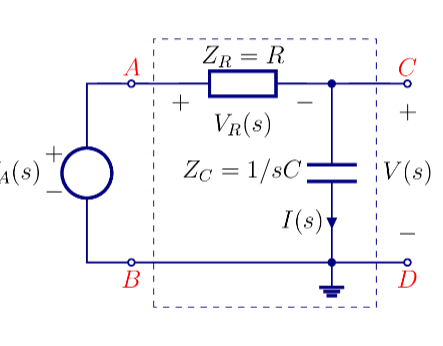

* Allmänna källor
* Komplexa nät med nodanalys
* Inga differentialekvationer
  * Kretsekvationer blir kvot av polynom i 𝑠
* Partialbråksuppdelning
  * Använd program för symbolisk matematik
  * Behövs bara för algebraisk lösning
* ”Trick” för sinussignaler, kommer strax!

**Överföringsfunktion**
Räkna med impedanser i s-domänen precis som
resistanser i tidsdomänen
  * Tillbaks till nodanalys & linjär algebra
  * Spänningsdelning ger överföringsfunktionen
```
V(s) = Z_C / (Z_R + Z_C) * V_A(s)

H(S) = 1 / (1 + sRC)
```

### Exempel med sinussignal in
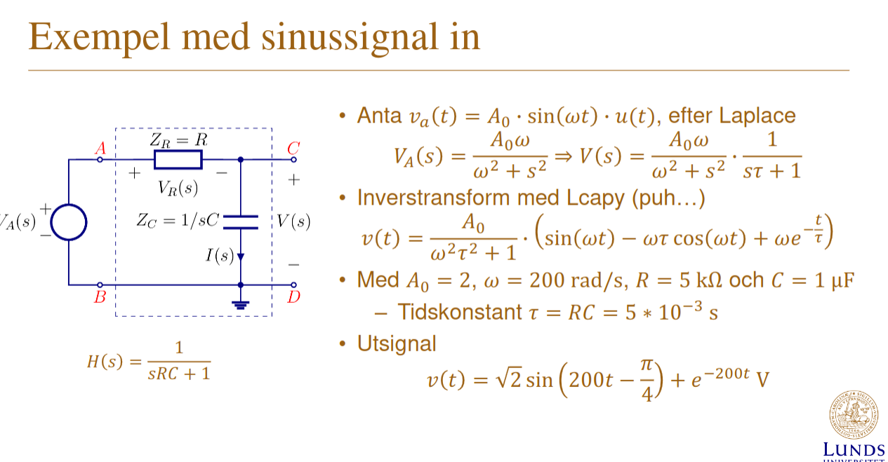
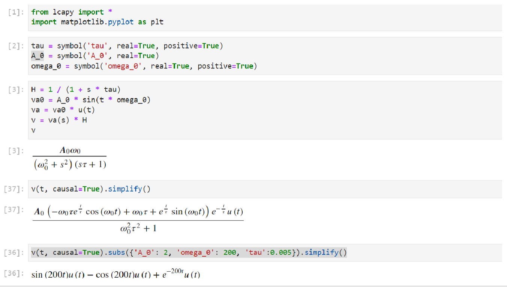

## Sinusformade signaler
Uppstår naturligt i många sammanhang

E_0 syftar på amplituden

och som vanligt:
T = pi/omega

### Spektrumanalys och 𝑗𝜔
Alla reella periodiska signaler kan beskrivas som
a(t) = a_0 + SUM(1->inf) a_n cos(n*omega*t + phi_n)
* omega = 2pi/T

* Uppdelning med fourier analys
  * Kan beräknas effektivt numeriskt mha DFT

* Analysera varje frekvens för sig 
  * Sätt sammman enligt superposition
  * Använd jw metoden: H(s), s = jw

### Fourieranalys
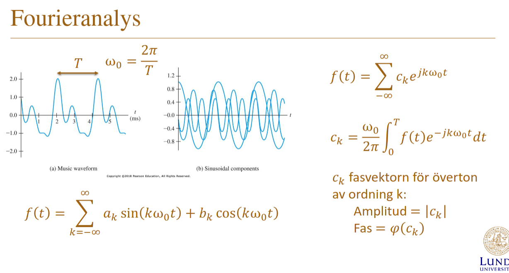
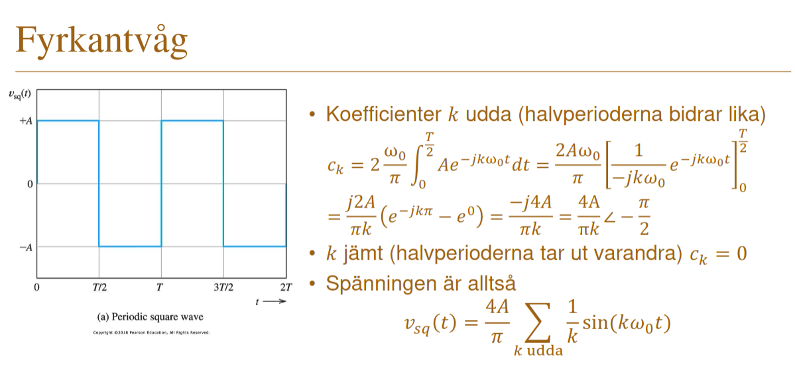

### Fyrkantvåg efter sampling
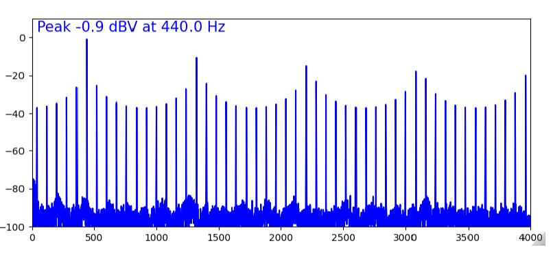


  

