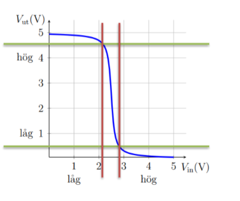

# Information
Tenta om man vill ha 4:a eller 5:a

Kursbok:  
https://lucris.lub.lu.se/ws/portalfiles/portal/133569346/main.pdf 

* Tror jag skippade lite från föreläsning 1 och 2
* Ej kunna matematika härledning av formler men förstå viss tanke bakom det
# Föreläsning 1
### Basics
puls, frekvens och våglängd formel
`f = 1/T`

### Hjälpmedel
* Kan använda av jupyter notebook
  * Python biiblotek
  * Klippa och klistra outputten

Behöver inte räkna ut det för hand

Note to self: Kolla upp förra boken?

# Föreläsning 2
### Begrepp
* Noder: Punkter där komponenter kopplas ihop via anslutningar
* Ström: `i = δq / δt` dvs tidsförändring av laddning q (C) per tidsenhet (s). Alt. i=U/R. Mäts i ampere (A)
* Spänning / potential: Den potentiella energi som finns för laddning. Mäts i volt. Då en laddning q rör sig genom kretsen ändras dess potentiella energi
* Effekt: Energi per tidsenhet i en komponent. Mäts i watt. `P = U * I`


---
### Kretselement / komponenter
* Kretselement är idealiserade modeller 
* Komponenter är verkliga komponenter. Kan behöva använda sig av flera kretselement för att beskriva komponenter

### Enheter
* Ω: R = U / I där R är resistansen, U är spänningen och I är strömmen. Linjär
* Kapacitet: C = Q / U där C är kapacitansen, Q är laddningen och U är spänningen. Linjär
* Induktans: L = U / I där L är induktansen, U är spänningen och I är strömmen
* Resitivitet (ρ) (motståndsförmåga);har enhet 1/σ dvs Ωm
* σ tror jag är ledningsförmåga. 

### Konduktans
* Konduktans är motsatsen till resistans   
* Ledningsförmåga (σ): Alla material kan leda
```
G = 1/R
```

Den har enheten siemens (S) = 1/Ω

### Transporten
* J (A/m^2) drivs av E
```
J=ρ*E
```  
* E är ...?

### Hur räknas motståndet/resistansen?
Om materialet är l lång och tvärsnitt A.  
* `R=V/I=ρ*l/A`

### Resistans exempel

```
ρ = 10^(-5) Ω meter
l = 50*10^(-3) meter
diameter = 0.5*10^(-3) meter
R =  ro*4*l/(4*pi*diameter^2) blir 2 Ω
```

---
### Energi och effekt
* Effekt är energi per tidsenhet.
* Mäts i joule eller Ws

```
V*A=J/C*C/s=J/s=W

```
Notera energi är effekten vid varje tidspunkt summerat
* Angpende vatten:
```
Effekt=Tryck*flöde*...
```


### Effekt
(exempelvist effektutveckling för en resistans)
Alternativt:
```
P = U*I
```
---
### Elektriska kretsar
* En elektrisk krets utgörs av
  * Enjukda jinoinenter
    * Fysiska föremål
    * Identifierbara anslutningspunkter

### Spänning 
 

### Ledare och noder
* Ledare: Anses beräknas vara ideala
  * ρ = 0
  * E = 0
  * i tillåts vara obegränsad

### Seriekoppling
Samma ström i går genom alla komponenter
Om komponenterna har resistanserna R1, R2, ..., Rn så blir resistansen i seriekopplingen R = R1 + R2 + ... + Rn
```
Dvs blir v = (R1 + R2 + ... + Rn) * i
```

### Parallellkoppling
Samma spänning v ligger över alla komponenter:
* Komponenterna brukar kallas parallellkopplade
```
1/R = 1/R1 + 1/R2 + ... + 1/Rn
```
dvs
```
i = v / R = v * (1/R1 + 1/R2 + ... + 1/Rn)
```

Dvs adderas konduktanserna i parallellkopplingen

* Specialfall: n = 2
```
R = R1 * R2 / (R1 + R2)
```

Notera även att för spänningar över komponenter:
v1=v2=-v3
Givet v3 är bakvänd satt

### Nät
* Nät: består av grenar som sammanbinds i knytpunkter. En gren måste innehålla åtminstoende en komponent.
* Node: En punkt där två grenar möts
* Väsentlig nod: En nod som har minst tre grenar som går in i den


---
### Nollställning  
* Spännignskälla: Nollställs genom kortslutning (ingen spänning)    
* *Strömkälla: Nollställs genom ett avbrott (ingen ström)
--- 
### Kritchoffs späningslag (KVL)
* Om man går runt i en slinga (cykel) så blir summan av spänningarna noll
  * Dvs om man går runt medurs eller moturs och kommer till samma punkt:
Spänning är samna som innan man gick
--- 
### Kapacitant, induktans
Kapacitans
* Elektriska fält
* Spänningströg

Induktans
* Magnetiska fält
* Strömtrög

---
### Krichoffs strömlag  (KCL)
* Ström in = ström ut (in i en nod)  
Dvs om ström in är i1 och i2 och ström ut är i3 så:
* `i1+i2=i3`
### Kondensator
Tog detta väldigt snabbt. Se slides

# Föreläsning 3

# Föreläsning 4
### (->) = Strömkälla
Det tecknet (->)2mA betyder att den skapar en ström 2mA åt det specifika hålet. Ingen annan ström finns över den vägen

### Spännignskälla  (- +)
Skapar en skillnad i spänning mellan de två punkterna

Spänningskälla skapar problem vid en spänningskälla
- Svårt att räkna för man behöver veta resistansen på spänningskällan
- Alternativ lösning: Anta ett område som är spänningkällan och dess två närmaste områden
  - Räkna strömmen in och ut ur detta område

**Exempelvist**
Har spänning v2 vid höger nod. Sedan en spänningskälla (- +) med spänningsskillnad två. Sedan en spänning v3 till höger nod.
- Vad är v2 och v3? 
  - Gör ström analys men även tänk å att v2+2=v3


### Styrda källor
Spänningskällor och strömkällor med riktning

**Exempelvist**
om vi har ->(+ -) -2 [V/mA]
I exemplet ovan har vi nu inte v2+2=v3
- Istället har vi v3=v2+(-2)(1-v2)*1/1

Dvs räknar ut spänningsskillnaden genom att ta -2*i
där i = (1-v2)*1/1 

**Exempelvist**
Nodera om vi har ->(+ -) 2 [V/mA]
så får vi lösningen 
* v3+v2=1
* v3+v2=2

Detta är rätt räknat, men vi har kopplat konstigt, så vi får positiv återgång (dvs g ökar i, som ökar g osv)

### Ekvivalent krets med källa (lite oklart)


Dvs tänk att vi har iA och iB.
- Det är linjär: så vi behöver bara två punkter för att räkna ut alla

vi har punkterna (i0, 0) och (0, v0) på i mot v graf
- Där `v0` är när `i = 0`
- vi är då v = 0 dvs vi har kortslutit kretsen

Kort sagt: Alla kretser som bestär av kombination av resistanser kan vi argumentera med hjälp av en **Thevenin ekvivalent krets**:


notera att lutningen på den linjära grafen bli R=v0/i0
- Så räkna enbart `v0` & `i0` tror jag
- Kan då lösa resten av punkterna med den resulterande grafen

### Recept för nodanalys
```
1. Slå samman resistanser
2. Välj noder och referensnod
3. Sätt ut nodspänningar
4. Skapa supernoder
5. Skriv nätekvationer
  1. KCL i vanliga noder och supernoder
  2. KVL för noder i supernoder
6. För styrda källor
  1. Uttryck i nodspänningar
  2. Substituera i nätekvationerna
7. Normalisera ekvationerna (matrisform)
8. Beräkna nodspänningar (invertera matrisen)
9. Beräkna strömmar och andra spänningar
```

* Generellt, fungerar alltid
* Finns ofta enklare sätt - hitta dom
* Ekvivalenter och superpositioner

---

### Generellt tips då jag hanterar kretsar 
* from what I have observed of what he has done
  
Om jag ska mäta resistansen eller spänningen mellan två punkter
- Förenkla systemet utifrån de punkter jag ska ska jämföra
- Så skillnaden mellan punkt a och b:
  - Rita a längst upp i en graf, sedan grenar, och sedan slutar i en punkt b. Så kort sagt förenklar bilden, så det är lättare att analysera

---
# Föreläsning 5
### Kondensator
```
C = kapacitans (konstant om man inte rör på kondensatorn)
q = laddning
v = spänning
```


```
i = δq/δt
q = C*v
    => i = C*δv/δt
```

**Hur mycket effekt levereras till kondensatorn eller en resistans**  

Alternativ 1:
```
p(t) = i(t)*v(t)
    => p(t) = C*δv/δt * v(t)
```

Alternativ 2: 

```
p(t) = abs(vC (t))^2/R
```

**Notera**: 
om `i = 0` 
=> `δv/δt = 0` 
=> spänningen är konstant 
(den bevaras även om strömmen stängs av)

**Hur mycket energi levereras från kondensatorn**  
- Note, denna typ av (enklare) integraler förväntas vi ha koll på

```
w(t) = w(0) + ∫p(t)dt  = ∫p(t)dt = **1/2*C*v(t)^2**
```

(w(0) = start effekten = oftast 0)
 


### Missade regeln för kondensatorer över distans

---
### Serie och parallellkopplade kondensatorer (tvärt emot resistanser - formler är tvärtom)
**parallelkopplade**
Att seriekoppla kondensatorer -> högre kapacitans
Formel: `C = C1 + C2 + ... + Cn`


**Seriekopplade**
Att parallellkoppla kondensatorer -> lägre kapacitans
Formel: `1/C = 1/C1 + 1/C2 + ... + 1/Cn`

### Att vrida tillbaka spänningen
- Ger tillbaka negativ spänning
  - Resulterar i ström åt andra hållet
    - enligt `i = C*δv/δt`

### Övning kondesatorer


Tydliggörelse: Den X liknande grejen i mitten är en strömbrytare med en pil över (ignonera pilen)

**Kortsluten krets**
Vid `t=t0` är strömbrytaren stängd
- Blir kortslutning (kan d ignonera högersidan)
- Vi kommer tillslut får `v(t) = 0`  oberoende av vad v(0) är
  - Enligt KSV så blir spääningen över R2 samma som spänningen över C (v(t))
  - Detta leder till en ström moturs. 
    - DVS man leder ström ut ur kondensatorn
  - i(t) i `i(t) = C*δv/δt` blir negativ
    - Dvs `δv/δt` är negativ. 
    - DVS spänningen blir tillslut noll
(Överkomplicera ej. Analysera folmerna bara)

**SIDENOTE**
Den sträckade lådan kallas fyrpol
```
v_in(t) = v_AB(t)
v_ut(t) = v_CD(t)
=>

h(t) = v_ut(t)/v_in(t)
H(s) = V_ut(s)/V_in(s) -- överföringsfunktion

```


**`i(t) = C*δv/δt`** i s-domänen
I(s) = CsV(s) - V
- Poängen är: Kan räkna i s-domän och det blir enklare

**Strömbrytaren öppen**
Kan slå ihop R1 och R2
Vi får då en spänning över R: V<sub>s</sub>v(t)
- Detta resulterar i en ström medurs
- Efter lång tid kommer då v(t) gå mot V<sub>s</sub> 

Då får vi 
```
v(t) = R*i(t)  -- Se till att du förstår varför
i(t) = C*δv(t)/δt
=> v(t) = -R*C*δv(t)/δt

-- löses med att räkna -R*C som konstant & V_s (tror det är startvärdet)
v(t) = V_s*e^(-t/RC)*u(t)

```
**Note**: Ofta görs benämningen τ = RC för att RC har enheten sekunder
**Note** u(t) är en stegfunktion (behövs den alltid?) 
**Note** V_s är start
**Note** C är en konstant. Behöver inte lösa för den

Todo: För att se hela uträckningen, hur vi kom fram till v(t) = V_s*e^(-t/RC)*u(t)
- se 9.7

# Föreläsningar missade
## MOS-transitstorn
* Förstärkning
  * Krävs överallt

* Olinjärt
  * Ofta linjärt i ett område

### Vad karakteriserar en MOS-transistor?
Antag B(ulk) och S(ource) sammankopplade

Mellan D(rain) och S(ource)
– Kanalen, transistorns utgående egenskap
– 𝑖𝐷 𝑡 = 𝑓 𝑣𝐷𝑆 𝑡 inga tidsberoenden
– 𝑓 beror av dopning, geometri, samt av...
Spänningen 𝑣𝐺𝑆 𝑡
– Styrspänningen, transistorns ingång
– 𝑖𝐺 (𝑡) ≅ 0, med liten parasitkapacitans
– Egenskap: Tröskelspänningen, 𝑉𝑡


### Varför behövs förstärkning?

Inne i digitala system
* En funktion driver flera
* Återställa nivåer

Mot omvärlden
* Belasta lite
* Driva mycket

AD-omvandling
* Kunna jämföra nivåer

## Digitala kretsar
### Representera booleska värden med spänning
- Vanliga val:

0 = v <= V_låg; 1 = v >= V_hög

* Otillåter område 
  * 𝑉_låg < 𝑣 < 𝑉_hög
    * Det passeras vid omslag
    * Den digitala funktionen är odefinierad
    * Marginal mot störningar


### Datablad för 74HC04
- Ingångar
- Utgångar

### H(S)
För digitala kretsar finns:
- Krav på insignalen (röda linjer)
  - Får inte vara mellan dom?
- Garantier för utsignalen(gröna linjer)
  - Kommer vara en av dom två antar jag

Överföringsfunktionen H(S) = V_ut(s)/V_in(s)
- Lutar brant (negativt för inverterare i det otillåtna området)
- Förstärkning abs(H(S)) > 1 mellan linjerna

Kan modelleras med soäningstyrd spänningskälla med g << -1
* Linjärrisering



## Grunka om förstäker

Rita in V_s = R * I_a + V_a
- Grafisk lösning "load line"
  - Blå linjen

- Läs av för 
  - Röd korsar vid (-0.5, 140)
  - Grön korsar vid (-1,5,210)
    - Ger Förstäkning g = -70

- Liknar en ivnerterare


## Inuti en CPU
### Råmaterialet kisel
- Halvledare
  - Dopas genom ersättning av atom
    - N-typ, elektronöverskott, ofta Fosfor
    - P-typ, elektronunderskott, ofta Bor
    - Koncentration 1013 − 1018 cm−3

### n-kanal MOSFET
Normalt 𝑉𝐵 = 0 övriga 𝑉 ≥ 0
– Alla ”dioder” blockerar

Gatespänningen 𝑣𝐺𝐵(𝑡)
– Styr Drainströmmen, 𝑖𝐷𝑆(𝑡)
– Ledande kanal D till S

Storlek = längden L
– 1971: ~10 μm
– Nu: ~10 nm

106 fler transistorer/yta

### Massor om CPU:er oklart om det är viktigt. Sida 20 och framåt
https://canvas.education.lu.se/courses/22921/files/3640268?module_item_id=863541


# Föreläsning 8
### CMOS NAND-grind


## Signaler 
- täcks inte av kursboken. Enbart kompendiumet
## Digititala domänen
- Kostar mindre
- Mindre hot att den störs

### Analogt till digitalt
- Heltal till realvärd
- Diskret till konturnuelig

**Antiviknignsfilter - sampling - kvantisering - kodare**

### Digitialt till analogt
- Realvärd till heltal
- Konturnuelig till diskret

**Omkodare - sample and hold - rekonstruktionsfilter**
(han förklarade ej dessa)

### Antivikningsfilter
  
### Sampling
Tittar på signalen vi vissa ögonblick

Tiden:
- Kontinuelig till diskret
  - Fortfarrande analoga värden

Om vi föjer Nyquist theorem så kan vi göra sampling utan informationsförlust
- om frekvens av sampling > 2 * frekvensen av signalen

### Kvantisering
Välj ett antal bitar och avrunda talen till det
- Påverkar precision

Vi får (2^n) - 1 nivåer
- står konstigt med 2^n i kompendiet
- 
### Kodare
- En möjlighet att överfära tal (tittar inte på det i kursen)
  - Ex vi vill ta varje 3 tal och göra ett decimaltal i guess

### Brus
- Lättare att tolka en digital signal som har blivit påvekar mot brus
  - Jämfört med analoga
    - För man vet hur de borde se ut: Dvs bara 0:or och 1:or

## Spektumanalys
- Alla reella periodiska signalen kan beskrivas med en funktioner a(t) 
- - a(t) består av ett antal cos() funktioner och konstanter

Uppdelning med fourieranalys
- kan beräknas efektivt numeriskt med DFT
- Analysera varje frekvens för sig
  - Sätt samman enligt superposition

Ett spektum är en samling av signaler

Finns ett trick där vi kan ... 

### Gradering av spektumdiagramet
- Mer behagligt att gradera spektumskalan i decibel

Logaritmisk magnitudskala, definition  
`abs(H(jɷ))dB = 20log_10(abs(H(jɷ)))`

- Enhetslös, kvnot mellan spänningar

 När dB används i effektskalor (pratar om effekt) gäller:
 - `10log_10(p1/p2)`
   - Detta är 1/100 av spänningen för det förhåller sig kvadratiskt 

## Periodiska signaler och effekt
Ögonblciseffekt vet vi är
```
p(t) = v^2(t)/R
```

Energi per period T
E_T = 1/R integral(from 0 to T, V^2(t) dt)

Ger medeleffekt
P = E_T/T = 1/T*1/R integral(from 0 to T, V^2(t) dt)

### Effektivvärde
Innebär att en periodisk spänning eller ström levererar samma effekt i en resisistans som en konstant sådan med samma värde
- Så 240V är effektivvärdet

* Se bild från 25/4

**För sinusvåg**
Beräkna effektivvärde:
V_rms = V/√(2)

där V_rms är effektivvärde

**Trekantvåg**
V_rms = V/√(3)

**Kvantiseringbrus**
- Uppstår pågrund att vi inte har oändligt många nivåer

Om vi lägger en signal som varierar med tid
- Kan beräkna snitteffekten för bruset: 
  - `C*N+a`
    - Där C och a är konstanter
    - N är antalet bitar (som ger uppstånd till bitar)

