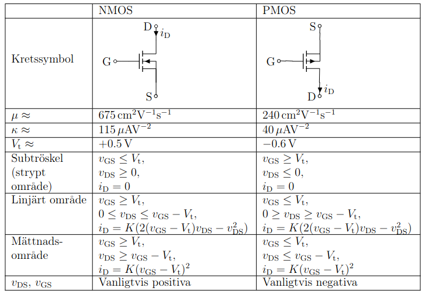
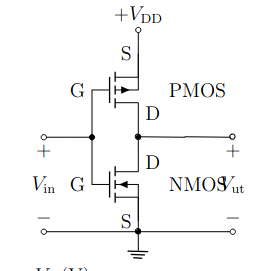

# Formelblad
- https://www.eit.lth.se/fileadmin/eit/courses/ess010/appadda_mod13.pdf

- https://canvas.education.lu.se/courses/22921/files/3393193?module_item_id=816009 

## Grundläggande
### Grundlagar
* `f = 1/T`

### Ström
* `i = δq / δt`
    * `δq` är laddningsskillnaden

### spänning
->(+ -)->
   * Om pilen representerar strömmens riktning så potentialen till höger lägre

### Resistans
* `R=V/I=ρ*l/A`
    * `ρ` är resistivitet

* Seriekoppling: `v = (R1 + R2 + ... + Rn) * i `

* Parallellkoppking: `v = (1/R1 + 1/R2 + ... + 1/Rn) * i`

### Kondensator
```
i = δq/δt
q = C*v
    => i = C*δv/δt
```
* Seriekoppling: `1/C = 1/C1 + 1/C2 + ... + 1/Cn`
* Parallelkoppling: `C = C1 + C2 + ... + Cn`

**Hur mycket effekt levereras till kondensatorn eller en resistans**  

Alternativ 1:
```
p(t) = i(t)*v(t)
    => p(t) = C*δv/δt * v(t)
```

Alternativ 2: 

```
p(t) = abs(vC (t))^2/R
```

**Hur mycket energi lagras i en kondensator**  
* `w(t) =  1/2*C*v(t)^2`

### Induktans
* Spänningen:
  * `v(t) = L * di(t)/dt`

* Lagrad energi:
  * `W = 1/2 * L * i(t)^2`

* Notera:
    * i(t) = integral(from 0 to t, v(t) dt) / L
        * DVS strömmen kan inte ändra sig omedelbart


### Effekt
* `p(t) = i(t) * v(t) = v(t)^2 / R = i(t)^2 * R`

* Ögonblickseffekt: p(t) = v^2(t)/R

### Energi
Energi per period T
* E_T = 1/R integral(from 0 to T, V^2(t) dt)

Ger medeleffekt
* P = E_T/T = 1/T*1/R integral(from 0 to T, V^2(t) dt)


## Frekvenser och amplituder
* V_pp = 2 * amplitude (point to point voltage)

### Decibel (tror detta stämmer)
- `20 * log_10 (v_2 / v_1)` -> dB
- `20 * log_10 (v)` -> dBV

**Tror detta stämmer bättre**
* `abs(H(jɷ))dB = 20log_10(abs(H(jɷ)))`
    * Medför: 10log_10(p1/p2)

## Effekt
### Effektivvärde
* Genomsnittlig effekt i en signal

* Fyrkantsvåg: V_eff = (amplitude)^2 tror jag
    * notera att (amp(t))^2 = amplitude^2

### Medeleffekt
* Medeleffekt (i form av värme som en resistans ger ut)
    * P = V * I = V^2 / R = I^2 * R
    * Occilerande: P = V_eff^2 / R

### Frekvensdiagram
1. f_s = sampelfrekvens
2. omega = `2 * pi * f` -> vinkelfrekvens
3. f_b = brytfrekvens = 1/(2*pi*R*C)


* Det som visas är effektivvärdet (dbV)
* Effektivvärde som visas är relativt till amplituden av k = 1(typ 4/pi)
* så k=1 har höjden av sitt effektivvärde i dbV, i jämfört med dess egna amplitud

* Hur mycket summerar alla topparna i frekvensdigrammet till?
    * Alla summerar till effektivvärdet av amplituden


* Signaler med f_n = n × f_s + f_blue
    * Oskiljbara från f_blue

## Omvandlare
### Analog till digital
V_lsb = V_ref / (2^n-1) = V_FS / (2^n-1)  
    * V_ref är referensspänningen  
    * V_FS är omfånget av spänningen  
        * Full-scale voltage   

* sampelvärde (icke binärt) hänvisar till utdata från omvandlaren (maximalt 2^n-1)
    * Så vid trunkering z++ vid V_lsb
    * Så vid avrundning z++ vid V_lsb / 2

* Beräkna m och k för AD omvandlare
    * hämta två punkter dvs x är en volt, och y är ett sampelvärde

## Filter
### Grundläggande
* Dämpningen vid brytfrekvensen är -3dB
    * Dämpningen vid brytfrekvensen är 1/sqrt(2) = 0.707
    * Härledning: 20log_10(w/w_b)
        * = 20log_10(1/sqrt(2))

* Decade: 10 gånger större frekvens

* H(S) = V_ut(s)/V_in(s)

* Första gradens RC filter
    * H(s) = v_ut(s)/v_in(s)
    * v_ut(s) = (1/sC)/(R+1/sC) * v_in(s)
    * H(s) = 1/(1+RCs)
        
* Andra gradens RC filter
    * H(s) = (1/1+R1C1s) * (1/1+R2C2s)
    * Härlett från det ovan

* Skriv V_ut(t) i termer av V_in(t)
    1. Gör som vanligt med H(S) eller spänningsdelning
    2. Dock glöm ej avtt även kolla w i insignalen
    3. Uttryck dina imaginära v_ut med A *vinkelgrej* vinkel
    4. Använd superposition och slå ihop dina två v_ut

### Dämpning och förstärkning
tror man beräknar det genom:
1. att sätta in s = jw
2. beräkna 20log_10(abs(H(jw)))
    - w är vinkelfrekvensen
        - w = 2*pi*f = 2*pi*440k exempevis
    - w_b är brytfrekvensen
        - w_b = 2*pi*f_b = 2 * pi * 1/(R*C)

2. Alternativt: 20log_10(abs(H(jw))) = 
    - 20log_10(abs(H(jw_b)))
    - Där man använder v(t)

### Impedans
* Impedans: Z = R + jwL + 1/jwC
    * R är resistans
    * L är induktans
    * C är kapacitans
    * Förläng med L och C med j vid förenkling

## MOS


### Förenklat
* K = kW/2L
    * k är konstant (det funky k)
    * W är bredden
    * L är längden
* Subtröskel: I_D = 0
* Linjärt: I_D = linjär
* Mättat: I_D = konstant
* Gate strömmen är 0 (idealt)

### Begrepp
* V_DD: Matningsspänning
* Statisk strömförbrukning: Strömförbrukning när komponenten är inaktiv
* Krav på inspänning
    1. 0 <= V_in <= V_DD
    2. !(v_in > v_h && v_in < v_l)
        * v_l är högsta spänningen som ger 0
        * v_h är lägsta spänningen som ger 1

### Beräkning av 


### Inverterare

Förklaring:
* Angående NMOS
    * När V_in är hög (dvs = V_DD) så -> V_GS > 0 -> Kan leda ström -> Kortslutning till jord -> V_ut = 0
    * V_GS är positiv då V_in är hög eftersom 
        * V_GS = V_G - V_S = positiv - 0 = positiv
* Angående PMOS
    * När V_in är låg (dvs = 0) -> V_GS < 0 -> Kan leda ström -> Kortslutning till V_DD -> V_ut = V_DD
    * V_GS är negativ då V_in är hög eftersom 
        * V_GS = V_G - V_S = 0 - V_DD = -V_DD


