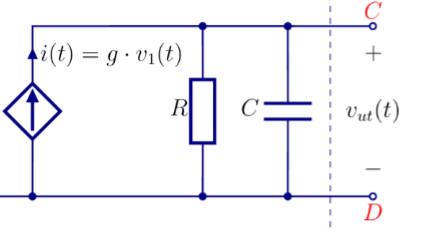
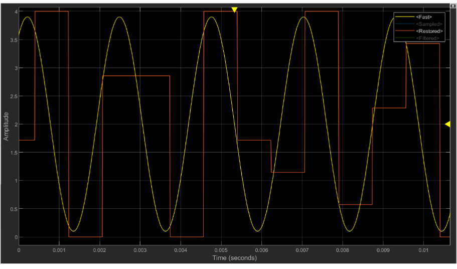
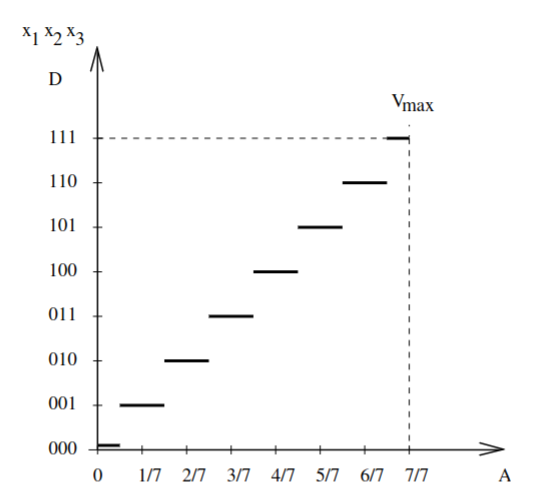
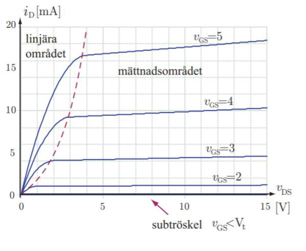
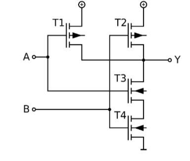
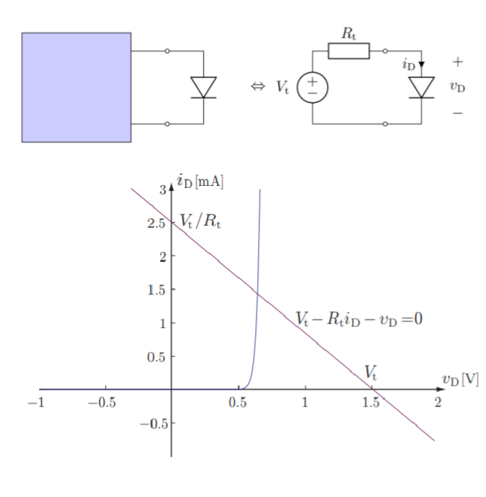

# Formelblad
- https://canvas.education.lu.se/courses/22921/files/3393193?module_item_id=816009 

- https://www.eit.lth.se/fileadmin/eit/courses/ess010/appadda_mod13.pdf


## Grundläggande
### Grundlagar
* `f = 1/T`

### Ström
* `i = δq / δt`
    * `δq` är laddningsskillnaden

### spänning
->(+ -)->
   * Om pilen representerar strömmens riktning så potentialen till höger lägre

### Resistans
* `R=V/I=ρ*l/A`
    * `ρ` är resistivitet

* Seriekoppling: `v = (R1 + R2 + ... + Rn) * i `

* Parallellkoppking: `v = (1/R1 + 1/R2 + ... + 1/Rn) * i`

* Spänningen i ett system kommer att vara konstant
    * Om en transistor finns med i syftemet, räkna inte med den
            * Se 2021, 5.4 om du vill se mer info 
                * Dess spänning är ett resultat av de andra komponenterna och de andra komponenterna har en konstant spänning i beleive
### Kondensator
* Kolla 9.7b) i boken för standardlösning
* Kan se det som en spänningskälla

* DC: Dess resistans är noll
    * Notera dock att den påverkar spänningen
    * DVS kan använda dess impedans (s-domän, icke jw) för att räkna ut spänningen
        * Så använd den i spänningsdelning exempelvist
        * Tänk kapitel 13
* AC: Den har impedans, som agerar som resistans
    * Det är ju då omega kommer in i bilden
```
i = δq/δt
q = C*v
    => i = C*δv/δt
```
* Seriekoppling: `1/C = 1/C1 + 1/C2 + ... + 1/Cn`
* Parallelkoppling: `C = C1 + C2 + ... + Cn`

**Hur mycket effekt levereras till kondensatorn eller en resistans**  

Alternativ 1:
```
p(t) = i(t)*v(t)
    => p(t) = C*δv/δt * v(t)
```

Alternativ 2: 

```
p(t) = abs(vC (t))^2/R
```

**Hur mycket energi lagras i en kondensator**  
* `w(t) =  1/2*C*v(t)^2`

**Hur mycket energi lagras i en krets**
* kondenstor + spole...?

**Generell lösning RC**
- Se anteckningar
men i korthet:
```
v(t) = V0*e^(-t/RC)
```
- Notera då även i(t) = v(t)/R

### Spole / induktans (inductor)
* DC: Dess resistans är noll (essentially)
* AC: Räkna med impedans
* Spänningen:
  * `v(t) = L * di(t)/dt`
  * För att hitta strömmen genom induktansen
    * Lös v(t) = ?, hitta startvärde i(0)
    * `i(t) = C + integral(from 0 to t, v(t) dt) / L`
    * Detta är lösningen så länge det går ström genom induktansen
        * Kan sätta dom gränsena utifrån lösningen av frågan
        * Om det går ström genom induktansen i början, lös ekvationen, och kolla hur länge det går ström igenom induktansen

* Kort sagt lösa ström genom spole:
    * Om ström är större än noll i början, hitta v(t), lös för i(t). Så länge den är större än noll, använd den lösningen
        


* Lagrad energi:
  * `W = 1/2 * L * i(t)^2`

* Notera:
    * i(t) = integral(from 0 to t, v(t) dt) / L
        * DVS strömmen kan inte ändra sig omedelbart  


* Notera att om vi har en spänning över en induktans så kommer strömmen att öka linjärt, dvs över lång tid är den oändlig, dvs v(t) noll

* Om jag kommer till att skillnad i i(t) = oändlig
    * v(t) = oändlig
    * DVS i(t) bevaras som den var precis innan, ändringen
    * Allt annat är "normalt"


### Effekt
* `p(t) = i(t) * v(t) = v(t)^2 / R = i(t)^2 * R`

* Ögonblickseffekt: p(t) = v^2(t)/R

### Energi
Energi per period T
* E_T = 1/R integral(from 0 to T, V^2(t) dt)

Ger medeleffekt
* P = E_T/T = 1/T*1/R integral(from 0 to T, V^2(t) dt)

### Superposition
* Kortslut alla strömkällor
* Avbryt kablar in i alla strömkällor

* Gör grundläggande superposition


### Sidenote

    - Notera att detta är spänningen över både
        - Borde ju vara samma som över C
## Delning
### Spänningsdelning
* Vill veta hur mycket spänning som går över R_1
* `v_1 = v * R_1 / (R_1 + R_2)`
* ...more applicable to series circuits


### Strömdelning
* Vill veta hur mycket ström som går genom R_1
* `i_1 = i * R_2 / (R_1 + R_2)`

### Mer komplex spänningsdelning
* R1 och R2 är i serie
* R3 och R4 är i serie
* V1 ligger över allt

* Vill ha spänningen över R1:
    * `v_R2 = v_1 * R_1 / (R_1 + R_2)`
    * Tror det går för de är parallellt
    * DVS över båda är samma som för hela kretsen, dvs v_1

## Frekvenser och amplituder
* V_pp = 2 * amplitude (point to point voltage)

Gul: Insignal till A/D
Orangea: Utsignal från D/A



### Vad är samplingfrekvens 
* Räkna antalet hold. Glöm inte den sista i intervallet. Den räknas med. 

### Maxialt fel
Vad är maximal spänningsskillnad mellan insignalen till A/D-omvandlaren och utsignalen
från D/A-omvandlaren direkt efter sampling?
- De sitter i serie
- Se bild i slides av vad de gör för steg.

I allafall V_lsb / 2 för avrundning och V_lsb för trunkering

### Decibel (tror detta stämmer)
- `20 * log_10 (v_2 / v_1)` -> dB
- `20 * log_10 (v)` -> dBV

**Tror detta stämmer bättre**
* `abs(H(jɷ))dB = 20log_10(abs(H(jɷ)))`
    * Medför: 10log_10(p1/p2)

### Fasvektorer
𝑉0∠𝜃 <-> 𝑉0(cos 𝜔𝑡 + 𝜃)

## Thevenin och Norton
### R_t
* Kortslut alla spänningskällor
* Avbryt kablar in i alla strömkällor

### V_t
* Ersätt resistorer där det ej går ström med kortslutningar (per URI)
* Beräkna V_A mha nodanalys och eventuellt superposition


### I_n
I_n = V_t / R_t

## Signaler, frekvenser
### Effektivvärde
* Genomsnittlig effekt i en signal

* Fyrkantsvåg: V_eff = (amplitude)^2 tror jag
    * notera att (amp(t))^2 = amplitude^2

### Medeleffekt
* Medeleffekt (i form av värme som en resistans ger ut)
    * P = V * I = V^2 / R = I^2 * R
    * Occilerande: P = V_eff^2 / R

### Frekvensdiagram
* Frekvens på x-axeln, effekt på y axeln

1. f_s = sampelfrekvens
2. omega = `2 * pi * f` -> vinkelfrekvens
3. f_b = brytfrekvens = 1/(2*pi*R*C)


* Det som visas är effektivvärdet (dbV)
* Effektivvärde som visas är relativt till amplituden av k = 1(typ 4/pi)
* så k=1 har höjden av sitt effektivvärde i dbV, i jämfört med dess egna amplitud

* Hur mycket summerar alla topparna i frekvensdigrammet till?
    * Alla summerar till effektivvärdet av amplituden


* Signaler med f_n = n × f_s + f_blue
    * Oskiljbara från f_blue

## Omvandlare
* Tar in -> AD -> D/A -> Ut
### Analog till digital
* Tar analoga värden och gör dem digitala (binära)

V_lsb = V_ref / (2^n-1) = V_FS / (2^n-1)  
    * V_ref är referensspänningen  
    * V_FS är omfånget av spänningen  
        * Full-scale voltage   

* sampelvärde (icke binärt) hänvisar till utdata från omvandlaren (maximalt 2^n-1)
    * Så vid trunkering z++ vid V_lsb
    * Så vid avrundning z++ vid V_lsb / 2

* Beräkna m och k för AD omvandlare
    * hämta två punkter dvs x är en volt, och y är ett sampelvärde

### Antivikningsfilter
- 80dB filterkrav betyder att en minskning på 80dB ska ske vid f_s-f_b
    - Det är ju signalerna mellan f_s-f_b och f_s som kommer att vikas in
    - Så man lovar att det är en minskning på åtminstoende 80dB där

- Nödvändig ordning på filtret på sida 5 i adda kompendiumet
### Digital till analog
* Representerar en binär signal med en spänning
### Kvantisering
* V_lsb = V_ref / (2^n-1) = V_FS / (2^n-1)  
    * V_ref är referensspänningen  
    * V_FS är omfånget av spänningen  
        * Full-scale voltage

* Bilden nedan visar hur 1/N till N/N bitar kommer att kvantiseras


## Filter
### Grundläggande
* Dämpningen vid brytfrekvensen är -3dB
    * Dämpningen vid brytfrekvensen är 1/sqrt(2) = 0.707
    * Härledning: 20log_10(w/w_b)
        * = 20log_10(1/sqrt(2))

* Decade: 10 gånger större frekvens

* H(S) = V_ut(s)/V_in(s)

* Första gradens RC filter
    * H(s) = v_ut(s)/v_in(s)
    * v_ut(s) = (1/sC)/(R+1/sC) * v_in(s)
    * H(s) = 1/(1+RCs)
        
* Andra gradens RC filter
    * H(s) = (1/1+R1C1s) * (1/1+R2C2s)
    * Härlett från det ovan
    * H(s) = H1(s) * H2(s)
    * H(s)_db = H1(s)_db + H2(s)_db

* Skriv V_ut(t) i termer av V_in(t)
    1. Gör som vanligt med H(S) eller spänningsdelning
    2. Dock glöm ej avtt även kolla w i insignalen
    3. Uttryck dina imaginära v_ut med A *vinkelgrej* vinkel
    4. Använd superposition och slå ihop dina två v_ut

### Dämpning och förstärkning
tror man beräknar det genom:
1. att sätta in s = jw
2. beräkna 20log_10(abs(H(jw)))
    - w är vinkelfrekvensen
        - w = 2*pi*f = 2*pi*440k exempevis
    - w_b är brytfrekvensen
        - w_b = 2*pi*f_b = 2 * pi * 1/(R*C)

2. Alternativt: 20log_10(abs(H(jw))) = 
    - 20log_10(abs(H(jw_b)))
    - Där man använder v(t)

### Impedans
* Impedans: Z = R + jwL + 1/jwC
    * R är resistans
    * L är induktans
    * C är kapacitans
    * Förläng med L och C med j vid förenkling

### Resonans vid frekvensen
Kräver att L och C har samma impedans med olika tecken, och vi får resonans vid:
* 1/2𝜋√𝐿𝐶

## MOS


strypt, linärt och mättat syftar på I_D
* Se grafiska lösningar i slidsen

### Förenklat
* K = kW/2L
    * k är konstant (det funky k)
    * W är bredden
    * L är längden
    * Finns även en alternativ uträckning till detta beroende på epsilon
* Subtröskel: I_D = 0
    * "V_out är 0" kan man typ säga...
* Linjärt: I_D = linjär
* Mättat: I_D = konstant
* Gate strömmen är 0 (idealt)

### Begrepp
* V_DD: Matningsspänning
* Statisk strömförbrukning:                  Strömförbrukning när komponenten är inaktiv
    * Sker då nmos och pmos leder samtidigt
* Krav på inspänning
    1. 0 <= V_in <= V_DD
    2. !(v_in > v_h && v_in < v_l)
        * v_l är högsta spänningen som ger 0
        * v_h är lägsta spänningen som ger 1
* Parasitkapacitans

### Beräkning av v_h och v_l & statisk strömförbrukning
* Med kravet att vi inte vill ha statisk strömförbrukning:
    1. v_l = abs(v_tn)
    2. v_h = v_DD - abs(v_tp)
    * v_tn är tröskelspänningen för nmos
    * v_tp är tröskelspänningen för pmos
    * Inte helt säker om absolutbeloppet ska vara där, men verkar som det

* Energi förbrukas då båda MOS leder
    * Dvs då v_in > v_l eller v_in < v_h

### Output spänning
* En MOS kommer antingen vara av eller på
    * Den gränsen går vid V_GS = V_tn
    * Dess output spänning kommer då öka tills den når V_DD
* Inputen ökar över tid
    * DVS kommer finnas ett läge där båda MOS leder (ger ut spänning)

### Approximation av seriekopplade MOS
* Två likadana, seriekopllade transistorer
    * Dvs samma W och L
    * Kan approximeras som en MOS med newL = 2L

T3 och T4 är seriekopplade  
Blanda inte ihop hur seriekopplade komponenter och seriekopplade transistorer ser ut


### Tidsberäkningar
* "Vilken tog längst tid"
    1. Flaskhalsen är transistorerna (räkna tiden för sladdar som 0)
    2. Tiden för en transistor att förändra sig till input är proportionell mot i_D 
        * DVS högre i_D -> snabbare
    3. i_D är proportionell mot K = kW/2L
    4. Så om något är dubbellt så långt, men 3 gånger större k -> 3/2 så lång tid

### Värmeutveckling
* Bara transistorer som det går ström igenom utvecklar värme
* DVS inaktiv (ex om PMOS får 0) -> ingen värme
* Om en transistor med total paracitkapacitans C byter håll så blir energiförbrukningen
    * E = 1/2 * C * V_DD^2
    

### Inverterare
  
Förklaring:
* Angående NMOS
    * När V_in är hög (dvs = V_DD) så -> V_GS > 0 -> Kan leda ström -> Kortslutning till jord -> V_ut = 0
    * V_GS är positiv då V_in är hög eftersom 
        * V_GS = V_G - V_S = positiv - 0 = positiv
* Angående PMOS
    * När V_in är låg (dvs = 0) -> V_GS < 0 -> Kan leda ström -> Kortslutning till V_DD -> V_ut = V_DD
    * V_GS är negativ då V_in är hög eftersom 
        * V_GS = V_G - V_S = 0 - V_DD = -V_DD

### Förbrukad effekt
* Som vanligt:
### Effekt
* `p(t) = i(t) * v(t)`
    * DVS vårt fall:
        * `p(t) = i_D(t) * v_DS`

## Diod
* Tänk också på att den kan bli en kortslutning
    * Dra inte för snabb slutsats om kapacitanser och spolar
* DVS om ström går mot en diod så vet vi att den har satisfactory spänning för att leda ström

### Centralt
* Om det går ström igenom dioden så är spänningen inställd på framspänningsfall
    * Spänningen underskrider aldrig framspänningsfallet
    * Se lösningen 2021.6.2 för mer info
### Begrepp
* Hur den fungerar:
    * Dioden leder ström i en riktning
        * Riktning = från anod till katod
        * DVS den riktningen som pilen pekar
    * Dioden leder inte ström i andra riktningen
    * DVS enbart om v(t) > 0 leder den ström

* Ideal: 
    * Framspänningsfall: 0V

* Framspänningsfall: 0.7V
    * DVS om v(t) > 0.7V leder den ström
    * DVS om v(t) < 0.7V leder den inte ström

## Olinjära komponenter
### Process (samt loadlinje)
* Förenkla allt som är linjärt med thevenin
* Gör en grafisk lösning
    * Plotta i_D = f(v_D) -> motsvarar genom och över det olinjära
    * V_t - R_t * i_D = v_D = f-1(i_D)
    * Rita linjen genom 
        1. punkterna I_D = 0 och V_D = V_t
        2. i_D = V_t / R_t och V_D = 0
    * Skärningspunkten är lösningen

### Fungerar även för transistorer



§